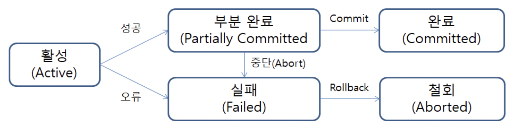

# 트랜잭션(Transaction)

# 한 문장 정리‼️

### 트랜잭션(Transaction)

트랜잭션은 작은 작업단위를 합친 쪼갤 수 없는 작업 묶음으로서, 전부가 완료되어야 정상적인 완료라고 판단합니다.

---

# 0. 트랜잭션(Transaction)이란?

트랜잭션의 사전적 정의 : 거래 

컴퓨터 과학분야에서의 트랜잭션 정의 : **쪼개질 수 없는 업무처리의 단위**

# 1. 트랜잭션의 예

ATM으로 계좌이체를 할때

1. A 은행에서 출금하여 B은행으로 송금
2. 송금 중, 알 수 없는 오류가 발생하여 A은행 계좌에서 돈은 빠져 나갔지만 B은행의 계좌에 입금되지 않음.
3. 이와 같은 상황을 막기위해 **모든 거래(출금,송금 : 트랜잭션)가 성공적으로 모두 끝나야** 이를 **완전한 거래로 승인(Commit)**하고, 거래 도중 뭔가 **오류가 발생**했을 땐 해당 거래를 처음부터 없었던 거래로 **완전히 되돌려야 함!(Rollback)**

출금과 송금에 대한 Task가 쪼개져서는 안됨!

즉, 더이상 쪼갤 수 없기 때문에 일부만 동작해서 안된다는 것이 트랜잭션의 핵심~!

# 2. 트랜잭션 명령어

부분 작업들 여러개가 모여진 이러한 트랜잭션을 처리하기 위해 데이터베이스는 다음 두가지 명령어를 활용함.

- **커밋(Commit) :** 모든 부분작업이 정상적으로 완료하면 이 변경사항을 한꺼번에 DB에 반영함.
- **롤백(Rollback) :** 부분 작업이 실패하면 트랜잭션 실행 전으로 되돌림.
    - 하나의 트랜잭션 처리가 비정상적으로 종료되어 데이터베이스 일관성을 깨드렸을 때 트랜잭션의 일부가 정상적으로 처리되었더라도 트랜잭션의 원자성을 구현하기 위해 이 트랜잭션이 행한 모든 연산을 취소하는 연산임.

- 이때, 모든 연산을 취소하지 않고 정해진 부분까지만 되돌리고 싶을 때 사용하는 것이 savepoint임.
- **SAVEPOINT :** 일반적으로 ROLLBACK을 명시하면 INSERT, DELETE, UPDATE 등의 작업 전체가 취소되지만, SAVEPOINT를 사용하면 전체가 아닌 **특정 부분에서 트랜잭션을 취소**시킬 수 있음.
    - 취소하려던 지점을 SAVEPOINT로 명시한뒤 `ROLLBACK TO SAVEPOINT_NAME;` 을 실행하면 지정한 해당 SAVEPOINT지점 까지 처리한 작업이 ROLLBACK 됨.
    - `SAVEPOINT SAVEPOINT_NAME;` (SAVEPOINT 지정)
    - `ROLLBACK TO SAVEPOINT_NAME;` (ROLLBACK)

# 3. 트랜잭션의 개념과 연산 과정

- 데이터 베이스 상태를 변환시키는 하나의 논리적 기능을 수행하기 위한 작업의 단위
- 데이터베이스 시스템에서 복구 및 병행 수행 시 처리되는 작업의 논리적 단위
- 한꺼번에 수행되어야 할 일련의 연산

**활성(Active)** : 트랜잭션이 정상적으로 실행중인 상태

**실패(Failed)** : 트랜잭션 실행에 오류가 발생하여 중단된 상태

**철회(Aborted)** : 트랜잭션이 비정상적으로 종료되어 **Rollback 연산**을 수행한 상태

**부분 완료(Partially Committed)** : 트랜잭션의 마지막 연산까지 실행했지만, Commit 연산이 실행되기 직전의 상태

**완료(Committed)** : 트랜잭션이 성공적으로 종료되어 Commit 연산을 실행한 후의 상태

# 4. 트랜잭션(Transaction)의 특징

ACID(Atomicity, Consistency, Isolation, Durability)는 데이터베이스 트랜젝션이 안전하게 수행된다는 것을 보장하기 위한 **트랜잭션의 특징**을 말함. (줄여서 ACID라고도 함)

- **원자성**(Atomicity) : 트랜잭션이 DB에 모두 반영되거나, 혹은 전혀 반영되지 않아야 함.
- **일관성**(Consistency) : 트랜잭션의 작업 처리 결과는 항상 일관성이 있어야 함.
- **독립성**(Isolation) : 둘 이상의 트랜잭션이 동시에 병행 실행되고 있을 때, 어떤 트랜잭션도 다른 트랜잭션 연산에 끼어들 수 없음.
- **영속성**(Durability→내구성,튼튼한,오래가는,영속적인) : 트랜잭션이 성공적으로 완료 되었으면 결과는 영구적으로 반영되어야 함.

---

### 참고자료

[[DB]트랜잭션(Transaction)이란?/트랜잭션의 개념,특징, 연산과정/savepoint](https://devuna.tistory.com/30)
