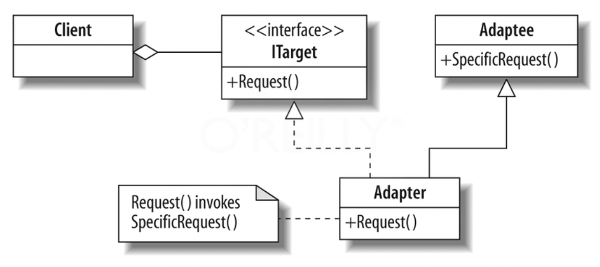
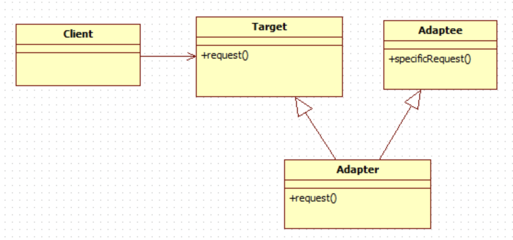

# 어댑터 패턴

# 한 문장 정리‼️

### 어댑터 패턴이란?

클라이언트는 변경하지 않고, 한 클래스의 인터페이스를 클라이언트에서 사용하고자 하는 **다른 인터페이스로 변환**하는 패턴 

---

# 0. 어댑터 패턴(Adapter Pattern)

### 용도 :

- 어떤 클래스를 바로 사용할 수 없는 경우 즉, 사용할 수 있는 형태로 변환이 필요할 때 변환할 역할을 해줄 수 있는 클래스 → 어댑터
- 호환되지 않는 인터페이스를 사용하는 클라이언트를 그대로 활용할 수 있음.
    - 클라이언트는 바뀔 필요가 없음!
    - 전기 콘셉트를 보면 이해하기 쉬움!

### 사용방법:

- 상속
- 위임: 어떤 메소드의 실제 처리를 다른 인스턴스의 메소드에게 맡기는 방법

### 클래스 다이어그램

**동작 순서:**

클라이언트 → request()→어댑터.request() →어댑티.SpecificRequest()

### 어댑터의 종류

- 객체 어댑터
    - 구성을 통해서 어댑티에 요청을 전달

- 클래스 어댑터
    - 어댑터를 만들 때 타겟과 어뎁티 모두의 서브 클래스로 만듬.

클래스 어뎁터 패턴을 쓰려면 다중 상속이 필요한데, **자바에선 다중 상속이 불가능**함.

---

### 참고 사이트

[디자인 패턴 정리](https://realzero0.github.io/study/2017/06/12/%EB%94%94%EC%9E%90%EC%9D%B8-%ED%8C%A8%ED%84%B4-%EC%A0%95%EB%A6%AC.html)

[디자인패턴 - 어댑터 패턴 (adapter pattern)](https://jusungpark.tistory.com/22)

[어댑터 패턴(Adapter Pattern)](https://invincibletyphoon.tistory.com/20)