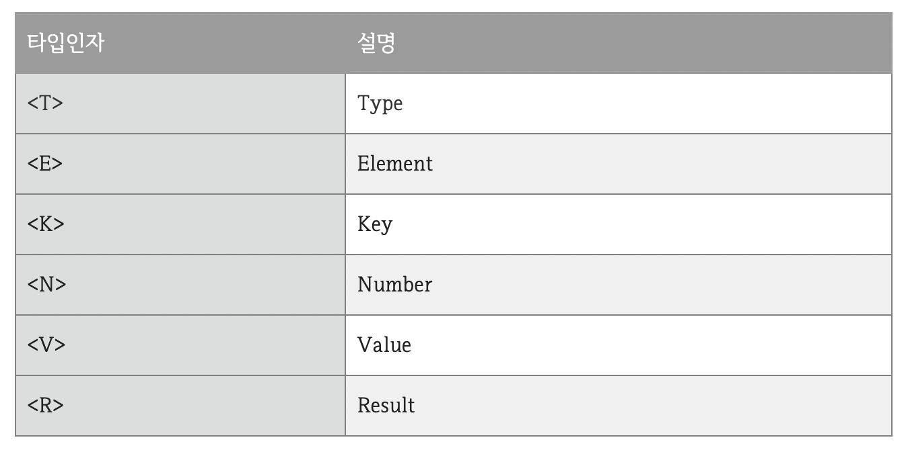

# Generic

# 한 문장 정리‼️

### Generic

잘못된 타입이 사용될 수 있는 문제를 컴파일 과정에서 제거할 수 있는 수단입니다.

자바 컴파일러는 코드에서 잘못 사용된 타입 때문에 발생하는 문제점을 제거하기 위해 제네릭 코드에 대해 강한 타입 체크를 합니다. 

실행 시 타입 에러가 나는것보다는 컴파일 시에 미리 타입을 강하게 체크해서 에러를 사전에 방지하는 것이 좋습니다.

클래스와 인터페이스, 메소드를 정의할 때 타입(type)을 파라미터(parameter)로 사용할 수 있습니다.

---

# 0. 제네릭을 사용하는 이유

잘못된 타입이 사용될 수 있는 문제를 컴파일 과정에서 제거할 수 있음.

클래스와 인터페이스, 메소드를 정의할 때 타입(type)을 파라미터(parameter)로 사용할 수 있음.

### 장점

1. **컴파일 시 강한 타입 체크를 할 수 있음.**
    - 실행시 타입 에러가 나는 것보다 컴파일 시에 미리 타입을 강하게 체크해서 에러를 사전에 방지함.
2. **타입 변환(casting)을 제거함.**
    - 비제네릭 코드는 불필요하게 타입 변환을 하기 때문에 프로그램 성능에 악영향을 미침.

    ```java
    // 비제네릭일 경우
    List list = new ArrayList();
    list.add("hello");
    String str = (String) list.get(0); // 타입 변환이 필요

    // 제네릭일 경우 
    List<String> list2 = new ArrayList<>();
    list2.add("hello");
    String str2 = list.get(0); // 불필요

    ```

# 1. 제네릭 타입(class, interface)

제네릭 타입은 타입을 파라미터로 가지는 클래스와 인터페이스를 말함.

클래스 또는 인터페이스 이름 뒤에 "<>"부호가 붙고, 사이에 타입 파라미터가 위치함.

```java
public class 클래스<T> { ... }
public interface 인터페이스<T> { ... }
```

타입파라미터는 일반적으로 **대문자 알파벳 한 글자**로 표현함. → T

### 자주 사용하는 타입인자



```java
// 비제네릭 타입 이용시
public class Corn{ 
	private Object obj;
	public Object get();
	public void set(Object obj);
} 
// 제네릭 타입 이용시
public class Corn<T>{
	private T t;
	public T get();
	public void set(T t);
}

```

Object 타입을 사용하면 모든 객체를 저장할 수 있는 장점이 있지만, 저장할 때 타입 변환이 발생하고, 읽어 올때에도 타입 변환이 발생함.

```java
public class Example{ 
	// 비제네릭 
	Corn cron = new Corn(); 
	corn.set("콘"); // String -> Object (자동 타입 변환) 
	String name = (String) corn.get(); // Object -> String (강제 타입 변환) 
	
	// 제네릭 
	Corn<String> corn = new Corn(); 
	cron.set("콘"); 
	String name = corn.get(); 
}
```

### 1. 멀티 타입 파라미터(class<K,V,...>, interfcae<K,V,...)

제네릭 타입은 두 개 이상의 멀티 파라미터를 이용할 수 있음.

이 경우 각 타입 파라미터는 콤마로 구분.

```java
public class Entry implements Map.Entry<K,V>{ 
	private K key; 
	private V value; 

	public Entry(K key, V value){
		this.key = key; this.value = value; 
	} 

	public K getKey(){ return this.key; } 
	public V getValue(){ return this.value;} 

.... 
}
```

### 2. 제네릭 메소드(<T, R> R method(T t))

제네릭 메소드는 **매개타입**과 **리턴타입**으로 타입파라미터를 갖는 메소드를 말함.

제네릭 메소드를 선언하는 방법은 리턴 타입 앞에 "<>" 기호를 추가하고 타입 파라미터를 기술한 다음, 리턴 타입과 매개 타입으로 타입 파라미터를 사용하면 됨.

```java
public <타입파라미터, ...> 리턴타입 메소드명(매개변수, ...) { ... } 
public <T> Corn<T> makePopCorn(T t) { ... } 

// 제네릭 메소드 호출 방법 
Corn<Integer> = <Integer>makePopCorn(10); // 명시적으로 Integer를 지정 
Corn<Integer> = makePopCorn(10); // Integer로 추정 (컴파일러가 매개 값을 보고 타입 추정)
```

### 3. 제한된 타입 파라미터(<T extends 최상위 타입>)

타입 파라미터에 지정되는 구체적인 타입은 제한될 필요가 있음!

- 예를 들어, 숫자를 연산하는 제네릭 메소드는 매개값으로 Number 타입 또는 하위 클래스 타입(Byte, Short, Integer, Long, Double)의 인스턴스만 가져야 함.
- 타입 파라미터 뒤에 extends 키워드를 붙이고 상위 타입을 명시함.
- 상위 타입은 클래스 뿐만 아니라 **인터페이스**도 가능 **(인터페이스라고 implements를 사용하지 않음!)**

```java
public <T extends Number> int compare(T t1, T t2){ 
	double v1 = t1.doubleValue(); 
	.... 
}
```

### 4. 와일드카드 타입(<?>, <? extends ..>, <? super ...>)

- 제네릭타입<?> : **제한 없음**
    - 모든 클래스나 인터페이스 타입이 올 수 있다.
- 제네릭타입<? extends 상위타입> : **상위 클래스 제한**
    - 와일드카드의 범위를 특정 객체의 **하위 클래스**만 올 수 있음.
        - 예를 들어 상위타입이 Object이면 모든 클래스가 다 올 수 있음.
- 제네릭타입<? super 하위타입> : **하위 클래스 제한**
    - 와일드카드의 범위를 특정 객체의 **상위 클래스**만 올 수 있음.
        - 예를 들어 하위타입이 Object이면 어떤 클래스도 올 수 없음.

---

### 참고 사이트

[[JAVA] 제네릭(Generic) 문법 정리](https://cornswrold.tistory.com/180)

[[Java] 제네릭(Generic) 사용법 & 예제 총정리](https://coding-factory.tistory.com/573)
