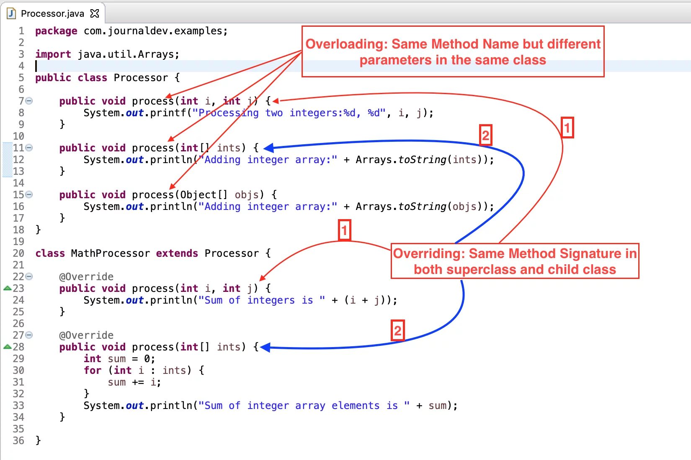

# Overriding vs Overloading

# 한줄 요약‼️

---

오버로딩(Overloading)과 오버라이딩(Overriding) 모두 다형성을 구현하는 방식들이다. 오버로딩은 정적바인딩 방식이고 오버라이딩은 동적바인딩 방식인데 이 점에서 발생하는 장단점들이 있으니 이 점을 유의하고 개발할 필요성이 있다. 

# 0. Overriding  vs Overloading

---



**Overriding** 과 **Overloading**은 Java에서의 핵심 개념입니다.

이 두 개념은 자바 프로그램에서 다형성(Polymorphism)을 구현하는 방법이기도 한데요.

**다형성**(Polymorphism)은 **OOP**(객체 지향 프로그래밍;Object Oriented Programming)의 개념 중 하나입니다. 

Overloading : 

- 하나의 클래스에 같은 메서드 이름이지만 다른 파라미터를 가지게 하는 것을 의미합니다.

Overriding: 

- 부모 클래스의 메서드를 자식 클래스의 메서드에서 재정의하여 사용하는 메서드를 의미합니다.

# 1. Overriding 과 Overloading의 차이점

---

### 1) **다형성**의 구현 시점 ( Implementation time of Polymorphism)

---

사용할 **메서드의 결정하는 시점**에 **차이**가 있다. 

- Overriding은 **런타임(Runtime)다형성을 구현**하고 런타임 때 호출할 메서드가 **결정**됩니다. → 동적 바인딩
- Overloading은 **컴파일 타임(Compile Time)다형성을 구현**하고 컴파일 타임 때 호출할 메서드가 **결정**됩니다. → 정적 바인딩
    - **개체 유형(타입)**에 따라 런타임에 메서드 호출이 결정됩니다.

**Overloading의 혼란 야기 코드**

```java
public class CollectionClassifier{

	public static String classify(Set<?> s){
	
		return "Set";
	
	}

	public static String classify(List<?> lst){
	
		return "List";
	
	}

	public static String classify(Collection<?> c){
	
		return "Unknown Collection";

	}

	public static void main(String[] args){

		Collection<?>[] collections = { new HashSet<String>(), new ArrayList<BigInteger>(), new HashMap<String, String>().values() };
			
			for( Collection<?> c : collections {
				System.out.println(classify(c));
			}
	}

}
```

위와 같은 코드에서 실행결과는 무엇일까? 

모두 "Unknown Collection"이 출력된다. 그 이유는 **Overloading**은 **컴파일 타임에** 사용될 메서드가 정해지는 **정적 바인딩**이기 때문이다.

오버로딩시 다음과 같이 매개변수의 수를 갖게 하여 사용할려고 할 때는 다음과 같이 혼란을 야기할 수 있기 때문에 **메서드 명을 바꾸는 등 보수적인 정책**을 취하는 것이 좋다. 

### 2) 발생 공간

---

두 방식의 발생 공간에는 차이점이 있다. 

- Overriding: 부모 클래스와 자식클래스 사이에서 발생된다.
- Overloading: 같은 클래스의 메서드 사이에서 발생한다.

### 3) 동일한 시그니쳐(형태), 차이가 있는 시그니쳐(형태)

---

하나의 방식은 동일한 시그니쳐를 띄고, 하나는 다른 시그니쳐를 띈다.

- Overriding: 메서드 이름, 인자(argument)가 모두 같다.
- Overloading: 메서드 이름은 같지만 parameters는 다르다.

### 4) 메서드 결정 타임으로 인한 특징

---

Overriding이 사용된 메서드에서 **중단(break)**되었을 경우, 런타임 때 결정되므로 프로그램에 큰 문제를 야기할 수 있지만,

Overloading이 사용된 메서드에서 **중단(break)**되었을 경우, 컴파일 타임 때 결정되므로 더 쉽게 문제를 해결할 수 있고 안전할 수 있다. 

### 참고자료

---

[Overriding vs Overloading in Java - JournalDev](https://www.journaldev.com/32182/overriding-vs-overloading-in-java)

[Java @override : 메서드 재정의 및 런타임 다형성 - 다른](https://ko.myservername.com/java-override-method-overriding)
