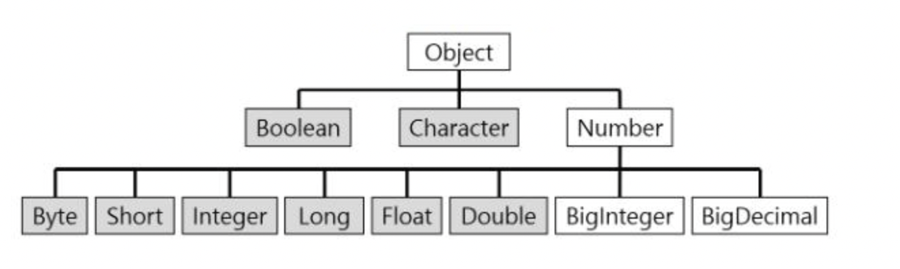
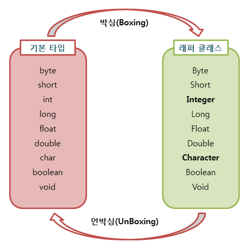

# Wrapper class

# 한줄 정리‼️

---

래퍼 클래스는 Java에서 **기본 타입을 객체화** 시키기 위한 클래스입니다. 

# 0. 래퍼 클래스(Wrapper Class)란?

---

### 1) 자바의 자료형

---

자바의 자료형은 크게 **기본 타입** (Primitive Type)과 **참조 타입** (reference type)으로 나누어져 있습니다. 

기본 타입은 char, int, float, double 등이 있고 참조 타입은 class, interface 등이 있습니다. 

개발을 하다보면 기본타입의 데이터를 객체로 표현하는 경우가 발생합니다. 이럴 때에 기본 자료타입(Primitive Type)을 객체로 다루기 위해서 사용하는 클래스들을 래퍼 클래스(Wrapper Class)라고 합니다. 

Java에서는  모든 기본 타입(Primitive Type)을  값을 갖는 객체로 생성할 수 있습니다. 

- 기본 타입 → 객체 : 포장 객체
    - 이유? 기본 타입의 값을 내부에 두고 포장하기 때문입니다.
- 래퍼 클래스로 감싸고 있는 기본 타입 값은 외부에서 변경할 수 없습니다.
    - 만약 값을 변경하고 싶으면 새로운 포장 객체를 만들어야 합니다.

### 2) 래퍼클래스의 종류

---

- 래퍼 클래스는 **java.lang** 패키지에 포함되어 있는데, 다음과 같이 기본 타입에 대응되는 래퍼클래스들이 있습니다.

[제목 없음](https://www.notion.so/6e2ca24d9c4644d3aadd4c4c04a1e1c0)

📍**java 에서 unsigned 의 지원**

Integer wrapper class 에서 toUnsignedLong과 같이 메서드로 지원함. 

### 3) 래퍼 클래스 구조도

---



- 모든 클래스의 부모는 Object 클래스 입니다.
- 숫자와 관련된 래퍼 클래스는 Number 클래스를 부모 클래스로 상속하고 있습니다.

📍**java 에서 큰 범위의 숫자 지원 클래스** 

- BigInteger : long 으로도 다룰 수 없는 큰 범위의 정수
- BigDecimal : double로도 다룰 수 없는 큰 범위의 부동소수점 수

# 1. 박싱(Boxing)과 언박싱(UnBoxing)

---

**기본 타입**과 이를 객체화 시키는 **래퍼 클래스**에는 

**박싱**과 **언박싱**의 개념이 사용되는데 

**박싱**은 기본타입의 값을 포장 객체로 만드는 과정을 의미하고 

**언박싱**은 그 반대로 포장객체에서 기본타입의 값을 얻어내는 과정을 언박싱이라고 합니다. 



**박싱 , 언박싱 예제 코드** 

```java
Integer num = new Integer(17); //박싱
int n = num.intValue(); //언박싱
System.out.println(n);
```

### **자동 박싱(AutoBoxing)과 자동 언박싱(AutoUnBoxing)**

---

박싱과 언박싱은 자바에서 자동으로 실행되는 경우가 있습니다.

- 자동 박싱:  래퍼 클래스 타입 변수에 대입될 경우 발생
    - `Integer num = 17; // 자동 박싱`
    - 이럴 경우 힙 영역에 Integer 객체가 생성됨.
- 자동 언박싱 : 기본 타입에 래퍼 클래스 변수를 대입할 때
    - `int n = num ; //자 동 언박싱`

### 값 비교

---

다른 일반적인 클래스와 달리 값을 비교할 때 **자동 박싱, 자동 언박싱이 적용**되어 기본타입과 래퍼클래스에는 특별한 값 비교 케이스가 존재합니다. 

- 래퍼 클래스 == 기본 타입 (true)
    - 자동 박싱 or 언박싱 발생
- 래퍼 클래스.equals(기본 타입) (true)
    - 자동 박싱 발생
- 래퍼 클래스 == 래퍼 클래스 (false)
    - == 연산자는 래퍼 객체의 참조 주소를 비교함.
- 래퍼 클래스.equals(래퍼 클래스)  (true)
    - 값 비교

# 참고문서

---

[[Java] 래퍼 클래스(Wrapper Class)란 무엇인가? (박싱, 언박싱)](https://coding-factory.tistory.com/547)

[Java에서 Unsigned를 만났을 때](https://dogfooter.github.io/Java-Does-not-support-unsigned/)

[[Java] java.lang 패키지 - 래퍼 클래스 (Wrapper Class)](https://pridiot.tistory.com/60)
