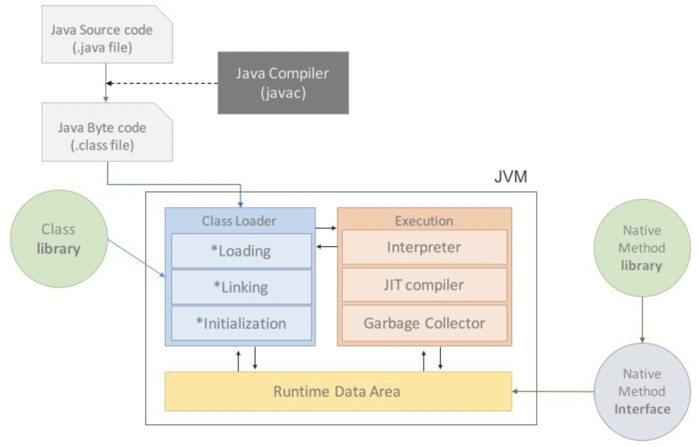
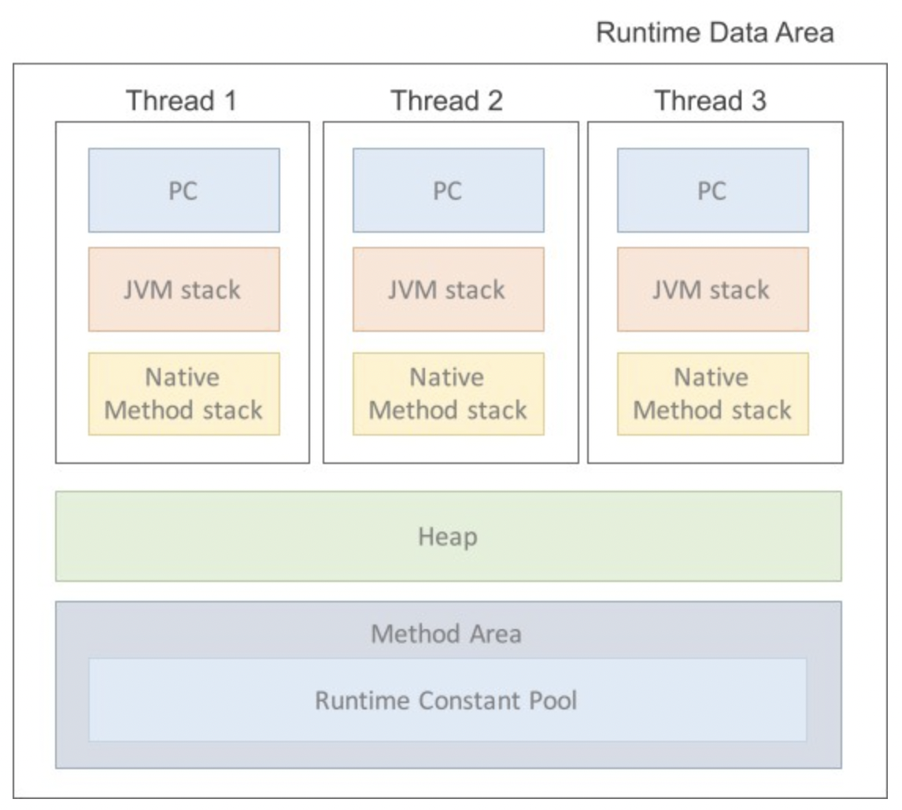
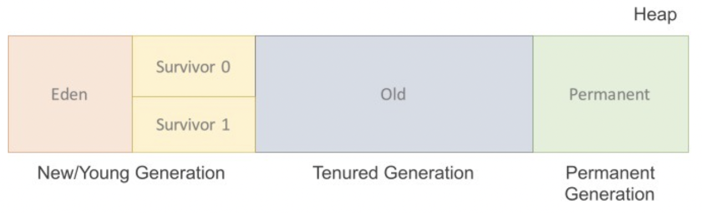
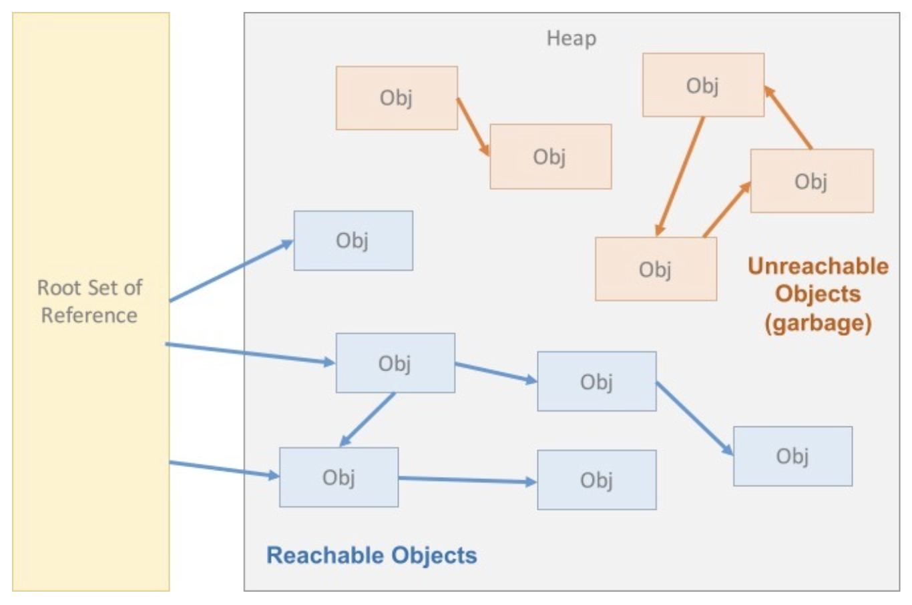

# JVM 에 대해서 / GC 의 원리

# 한 문장 정리‼️

### JVM

**JVM**은 Java와 OS 사이에서 중개자 역할을 하고 JAVA가 OS에 구애 받지 않고 메모리를 재사용할 수 있게함. → 메모리 관리의 역할을 수행

### GC

**GC**는 JVM 에서 참조되지 않는 인스턴스를 소멸시키며 메모리관리를 수행함.

---

# 0. JVM (Java Virtual Machine)

- **스택 기반**의 가상 머신
    - ARM 아키텍처 같은 하드웨어는 레지스터 기반으로 동작하는데 비해 JVM은 스택 기반으로 동작함.

### 역할

자바 애플리케이션을 클래스 로더를 통해 읽어 자바 API와 함께 실행하는 것임.

JAVA와 OS 사이에서 **중개자 역할**을 수행하여 JAVA가 OS에 구애받지 않고 재사용을 가능하게 해줌. 

그리고 가장 중요한 메모리 관리를 **Garbage Collecion**을 통해 수행함. 

### 알아야 하는 이유

한정된 메모리를 효율적으로 사용하여 최고의 성능을 내기 위해서

→ 그럴려면 메모리 구조를 알아야 함.

### 자바 프로그램 실행 과정

1. 프로그램이 실행되면 JVM은 OS로부터 이 프로그램이 필요로 하는 메모리를 할당 받음.

    → JVM은 이 메모리를 용도에 따라 여러 영역으로 나누어 관리함.

2. 자바 컴파일러(javac)가 자바 소스코드(.java)를 읽어들여 자바 바이트코드(.class)로 변환시킴.
3. Class Loader를 통해 class 파일들을 JVM으로 로딩함.
4. 로딩된 class 파일들을 Execution engine 을 통해 해석됨.
5. 해석된 바이트 코드는 Runtime Data Areas 에 배치되어 실질적인 수행이 이루어짐.

이러한 실행 과정 속에서 JVM은 필요에 따라 Thread Synchronization과 GC같은 관리작업을 수행함.

### JAVA 프로그램 실행 과정 이미지

### JVM 구성

- **Class Loader(클래스 로더)**
    - JVM내로 클래스(.class 파일)를 로드하고, 링크를 통해 배치하는 작업을 수행하는 모듈임.
    - Runtime 시에 동적으로 클래스를 로드함.
    - jar 파일 내 저장된 클래스들을 JVM위에 탑재하고 사용하지 않는 클래스들은 메모리에서 삭제함.
    - 컴파일러 역할
        - 자바는 동적코드, 컴파일 타임이 아니라 런타임에 참조함.
        - 즉, 클래스를 처음 참조할 때, 해당 클래스를 로드하고 링크함.
- **Excution Engine(실행 엔진)**
    - 클래스를 실행시키는 역할.
    - 클래스 로더가 JVM내의 **런타임 데이터 영역**에 **바이트 코드를 배치**시키고 이것은 **실행 엔진에 의해 실행**됨.
    - **자바 바이트코드**는 기계가 바로 수행할 수 있는 언어보다는 비교적 **인간이 보기 편한 형태로 기술된 것**임.
    - 그래서 실행 엔진은 이와 같은 **바이트 코드를** 실제로 JVM내부에서 **기계가 실행할 수 있는 형태로 변경**함. → 2가지 방식으로 사용
        - **Interpreter(인터프리터)**
            - 실행 엔진은 자바 바이트 코드를 명령어 단위로 읽어서 실행.
            - 인터프리터 언어의 단점을 그대로 갖고 있음.
                - 한 줄 씩 수행하기 때문에 느림!!
        - **JIT(Just - In - Time)**
            - 인터프리터 방식의 단점을 보완하기 위해 도입된 JIT 컴파일러임.
            - 인터프리터 방식으로 실행하다가 적절한 시점에 **바이트코드 전체를 컴파일하여 네티이브 코드로 변경**하고, 이후에는 해당 더 이상 인터프리팅 하지 않고 **네이티브 코드로 직접 실행**하는 방식.
            - 네이티브 코드는 **캐시에 보관**하기 때문에 **한번 컴파일된 코드는 빠르게 수행됨**.
            - 물론 JIT 컴파일러가 컴파일 하는 과정은 바이트 코드를 인터프리팅 하는 것 보다 훨씬 오래 걸리므로 **한 번만 실행되는 코드**라면 컴파일하지 않고 **인터프리팅하는 것이 유리**함.
                - 따라서 JIT 컴파일러를 사용하는 JVM들은 내부적으로 해당 메서드가 **얼마나 자주 수행되는지 체크**하고, **일정 정도를 넘을 때에만 컴파일을 수행**함.
    - **Garbage collector**
        - GC를 수행하는 모듈(Thread)이 있음.
- **Runtime Data Area**
    - 프로그램을 수행하기 위해 OS에서 할당받은 메모리 공간

    

    - 1) PC Register
        - Thread 가 시작될 때 생성되며 **생성될 때마다 생성되는 공간**으로 스레드마다 하나씩 존재함.
        - Thread가 어떤 부분을 어떤 명령으로 실행해야할지에 대한 기록을 하는 부분으로 **현재 수행 중인 JVM 명령의 주소**를 갖음.
    - 2) JVM Stack Area
        - 프로그램 실행과정에서 임시로 할당되었다가 **메소드를 빠져나가면 바로 소멸되는 특성의 데이터를 저장**하기 위한 영역임.
        - 각종 형태의 **변수**나 **임시 데이터**, **스레드**나 **메소드**의 정보를 **저장**함.
        - 메소드 호출 시마다 각각의 **스택 프레임**(그 메서드만을 위한 공간)이 **생성**됨.
        - 메서드 수행이 끝나면 **프레임 별로 삭제**를 함.
        - 메소드 안에서 사용되는 값들(**local variable)을 저장**함.
        - 또 호출된 메소드의 **매개변수, 지역변수, 리턴 값** 및 연산 시 일어나는 값들을 **임시로 저장**함.
    - 3) Native Method Stack
        - 자바 프로그램이 컴파일 되어 생성되는 바이트 코드가 아닌 **실제 실행할 수 있는 기계어로 작성된 프로그램을 실행**시키는 영역임.
        - JAVA가 아닌 **다른 언어로 작성된 코드를 위한 공간**임.
        - JAVA Native Interface를 통해 **바이트코드로 전환하여 저장하게 됨**.
        - 일반 프로그램처럼 **커널**이 스택을 잡아 **독자적으로 프로그램을 실행**시키는 영역임.
            - 이 부분을 통해 C code를 실행시켜 Kernel에 접근할 수 있음.
    - 4) Method Area
        - 클래스 정보를 처음 메모리 공간에 올릴 때 **초기화 되는 대상을 저장하기 위한 메모리 공간.**
        - **올라가게 되는 메소드의 바이트 코드**는 프로그램의 흐름을 구성하는 바이트 코드임.
            - 올라가는 정보의 종류
            - 1) Field Information
                - 멤버변수의 이름, 데이터의 타입, 접근 제어자에 대한 정보
            - 2) Method Information
                - 메소드의 이름, 리턴타입, 매개변수, 접근 제어자에 대한 정보
            - 3) Type Inforamtion
                - class인지 interface인지의 여부 저장
                - Type의 속성, 전체 이름, super class의 전체 이름(interface 이거나 object 인 경우 제외)
        - 자바 프로그램은 main 메소드의 호출에서부터 계속된 메소드의 호출로 흐름을 이어나가기 때문임.
        - 대부분 인스턴스의 생성도 메소드 내에서 명령하고 호출함.
        - 사실상 컴파일된 바이트코드의 대부분이 메소드 바이트코드이기 때문에 거의 모든 바이트코드가 올라간다고 봐도 상관 없음.
        - Runtime Constant Pool 이라는 별도 관리 영역도 함께 존재함.
            - 상수 자료형을 저장하여 참조하고 중복을 막는 역할을 수행함.

    - 5) Heap (힙 영역)
        - 객체를 저장하는 가상 메모리 공간임.
        - new 연산자로 생성된 객체와 배열을 저장함.
        - 물론 class area 영역에 올라온 클래스들만 객체로 생성할 수 있음.
        - 3가지 부분으로 구분됨.

        

        1. New/Young 영역
            - Eden : 객체들이 최초로 생성되는 공간
            - Survivor 0/1: Eden에서 참조되는 객체들이 저장되는 공간
        2. Old 영역
            - New area에서 일정 시간 참조되고 있는 ,살아남은 객체들이 저장되는 공간.
            - Eden 영역에 객체가 가득차게 되면 **첫번째 GC(minor GC)**가 발생함.
            - Eden영역에 있는 값들을 Survivor 1 영역에 복사하고 이 영역을 제외한 나머지 영역의 객체를 삭제함.
        3. Permanent Generation 영역
            - 생성된 객체들의 정보의 주소값이 저장된 공간.
            - Class Loader에 의해 load되는 Class, Method  등에 대한 Meta 정보가 저장되는 영역이고, JVM에 의해 사용됨.
            - **Reflection** 을 사용하여 **동적으로 클래스가 로딩**되는 경우에 사용.
            - 내부적으로 Reflection 기능을 자주 사용하는 Spring Framework를 이용할 경우 이 영역에 대한 고려가 필요함.

# 1. GC(Garbage Collection)

### Minor GC

새로 생성된 대부분의 객체(Instance)는 Eden 영역에 위치함. Eden 영역에서 GC가 한번 발생한 후 살아남은 객체는 Survivor 영역 중 하나로 이동함.

이과정을 반복하다가 계속해서 살아남아 있는 객체는 일정시간 참조되고 있다는 뜻이므로 Old영역으로 이동시킴.

### Major GC

Old 영역에 있는 모든 객체들을 검사하여 참조되지 않은 객체들을 한꺼번에 삭제함. 시간이 오래 걸리고 실행 중 프로세스가 정지됨. 

→ 'Stop-the-world'라고 함. 

Major GC가 발생하면 GC를 실행하는 스레드를 제외한 나머지 스레드는 모두 작업을 멈춤. GC 작업을 완료한 이후에 중단되었던 작업들을 다시 시작함.

### Garbage Collection 의 원리

알고리즘에 따라 동작 방식이 다양하지만 공통적인 원리가 있음.

Garbage Collector 는 힙 내에 객체 중에서 가비지(Garbage)를 찾아내고 찾아낸 가비지를 처리해서 힙의 메모리를 회수함. 

참조되고 있지 않은 겍체(Instance)를 가비지라고 하며 객체가 가비지인지 아닌지 판단하기 위해서 **reachability**라는 개념을 사용.

→ 어떤 힙 영역에 **할당된 객체가 유효한 참조**가 있으면 **reachability**, 없으면 **unreachability**로 판단.

하나의 객체가 다른 객체를 참조하고, 다른 객체는 또 다른 객체를 참조하는 참조 사슬이 형성된 경우가 있을 수 있는데, 이 **참조 사슬 중 최초에 참조한 것**을 **Root Set**이라고 함.

### **힙 내의 4가지 참조 경우**

1. 힙 내의 다른 객체에 의한 참조
2. Java 스택, 즉 Java 메서드 실행 시에 사용하는 지역변수와 파라미터들에 의한 참조
3. 네이티브 스택(JNI, Java Native Interface)에 의해 생성된 객체에 대한 참조
4. 메서드 영역의 정적 변수에 의한 참조 

2,3,4 → Root set 

인스턴스가 **가비지 컬렉션의 대상이 되었다고 해서 바로 소멸되는 것은 아님.**

빈번한 가비지 컬렉션의 실행은 시스템에 부담이 될 수 있기에 성능에 영향을 미치지 않도록 **가비지 컬렉션 실행 타이밍은** 별도의 알고리즘을 기반을 **계산되어** 가비지 컬렉션이 **수행됨.**

---

### 참고 사이트

[#자바가상머신, JVM(Java Virtual Machine)이란 무엇인가?](https://asfirstalways.tistory.com/158)

[#가비지컬렉션(Garbage Collection) / JVM 구동원리에 이어서](https://asfirstalways.tistory.com/159)