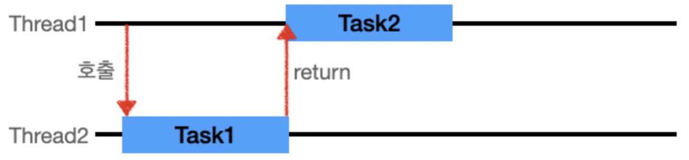
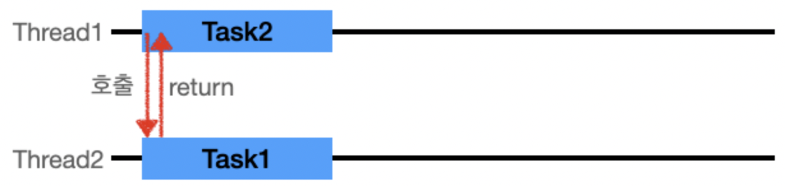
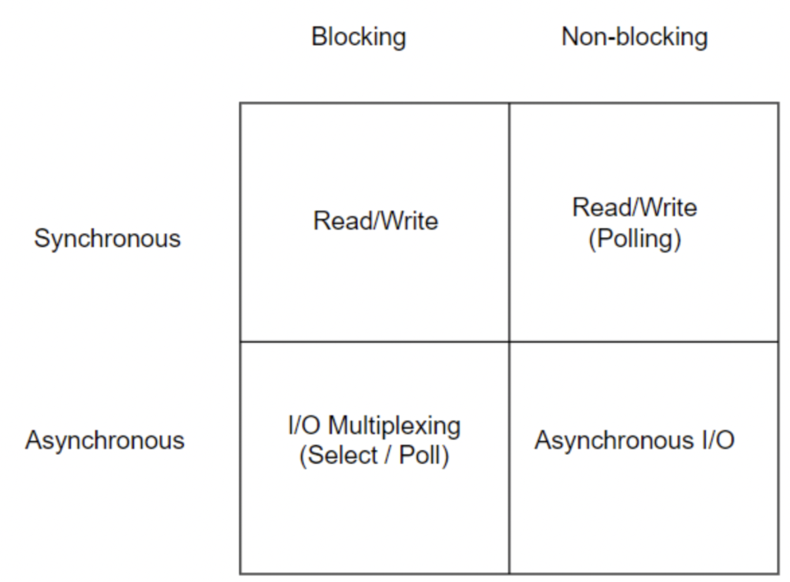

# Blocking & Non-Blocking I/O

# 한 문장 정리‼️

### 동기,비동기

특정 작업을 요청했을 때, 요청한 스레드가 작업 완료를 기다리면 동기,

요청받은 스레드가 작업 완료를 신경쓰면 비동기.

### Blocking, Non-blocking

특정 작업을 요청했을 때, 바로 바로 return 하면 Non-blocking

특정 작업을 요청했을 때, 바로 바로 return 안하면 blocking

---

# 0. 동기(Synchronous) vs 비동기(Asynchronous)

### 동기(Synchronous)

- `Thread1`이 작업을 시작 시키고, Task1이 끝날때까지 기다렷다가 Task2를 시작함.
- 작업 요청을 했을 떄 요청의 **결과값(return)을 직접 받음.**
- 요청의 결과값이 return값과 동일함.
- **호출한 함수가 작업 완료를 신경 씀.**

### 비동기(Asynchronous)

- `Thread1`이 작업을 시작 시키고, 완료를 기다리지 않고, `Thread1`은 다른 일을 처리할 수 있다.
- 작업 요청을 했을 때 요청의 **결과값(return)을 간접적으로 받음.**
- 요청의 결과값이 return값과 다를 수 있음.
- 해당 요청 작업은 별도의 스레드에서 실행하게 됨.
- 콜백을 통한 처리가 비동기 처리라고 할 수 있음.
- **호출된 함수(callback 함수)가 작업 완료를 신경 씀.**

# 1. blocking vs non-blocking

blocking과 non-blocking은 주로 IO의 읽기, 쓰기에서 사용됨.

### blocking

- **요청한 작업을 마칠 때까지 계속 대기함.**
- 즉시 return함.
- return 값을 받아야 끝남.
- Thread 관점으로 본다면, 요청한 작업을 마칠 때까지 계속 대기하며 return 값을 받을 때까지 한 Thread를 계속 사용/대기 함.

### non-blocking

- **요청한 작업을 즉시 마칠 수 없다면 즉시 return함.**
- 즉시 리턴하지 않음. (일을 못하게 막음)
- Thread 관점으로 본다면, 하나의 Thread가 여러 개의 IO를 처리 가능함.

# 2. 동기/비동기,blocking/non-blocing 차이

동기/비동기, blocking/non-blocking 두 그룹의 차이는 **관심사가 다름.**

### blocking/non-blocking

- 주요 관심사 : 호출되는 함수가 바로 return 하냐 마냐
- non-blocking:
    - 호출된 함수가 **바로 return해서 호출한 함수에게 제어권을 넘겨주고 호출한 함수가 다른 일을 할 수 있는 기회**를 줄 수 있음.
- blocking:
    - 호출된 함수가 **자신의 작업을 모두 마칠 때까지** 호출한 함수에게 **제어권을 넘겨주지 않고 대기**하게 만듬.

### 동기/비동기

- 주요 관심사 : 호출되는 함수의 **작업 완료 여부를 누가 신경쓰느냐**
- 비동기:
    - 호출되는 함수에게 **callback**을 전달해서 호출되는 함수의 작업이 완료되면 호출되는 함수가 전달받은 callback을 실행하고, **호출한 함수는 작업 완료 여부를 신경쓰지 않음.**
- 동기:
    - 호출하는 함수가 호출되는 함수의 작업 완료 후 **return을 기다리거나** 호출되는 함수로부터 바로 return 받더라도 **작업 완료 여부를 호출한 함수 스스로 확인**하며 신경 씀.

# 3. 동기/비동기, blocking/non-blocking 조합

**예시**

상황 : 급하게 알아야 하는 답을 누군가에게 물어봐야하는 상황

- 전화로 물어봐서 즉답을 얻음 : **동기 요청 처리**
- 이메일로 물어보고 메일 송신을 완료(return)했지만 답은 언제 올지 모름 = **비동기 요청 처리**
- 전화를 했는데 상대방이 너무 바빠 전화를 받지 않음.
    - 전화를 받을때까지 계속 대기 → **동기 + 블록킹**
    - 전화를 했는데 안받음
        - 끊었다가 나중에 다시 전화함.
        - 계속 반복했다가 어느 순간에 받아서 답을 얻음 = **동기 + 논블록킹**

---

### 참고자료

[동기 vs 비동기 (feat. blocking vs non-blocking)](https://velog.io/@wonhee010/동기vs비동기-feat.-blocking-vs-non-blocking)
