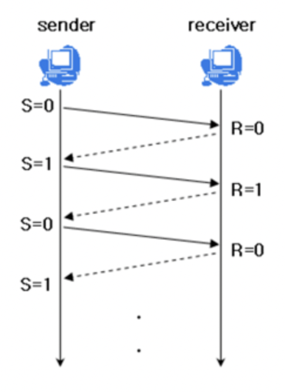
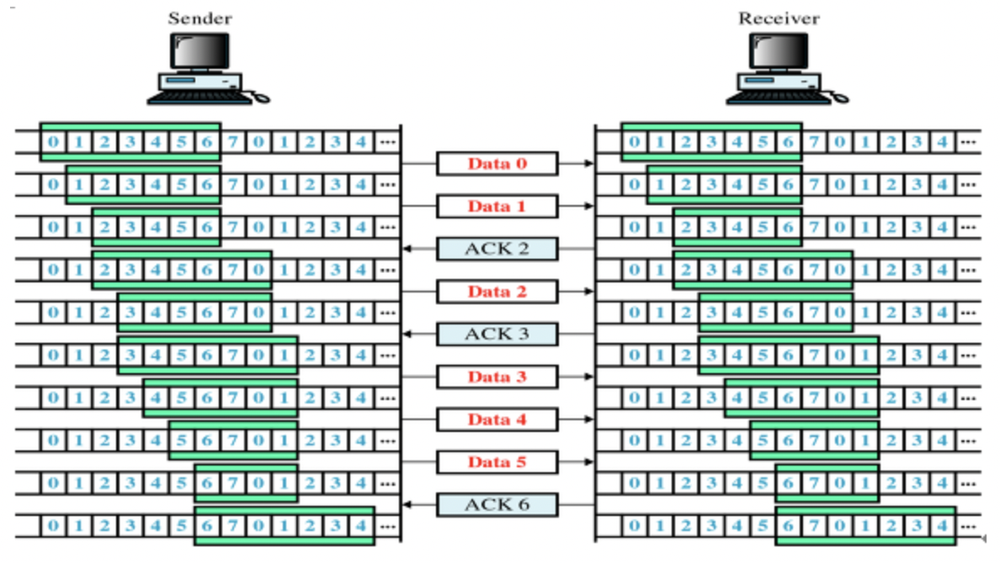
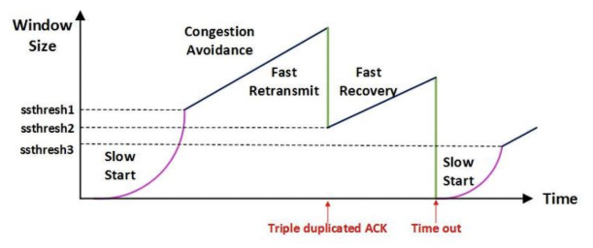

# TCP/IP 흐름제어 & 혼잡제어

# 한 문장 정리‼️

### 흐름 제어 :

**송신측과 수신측의 데이터 처리 속도 차이**를 해결하기 위한 기법

### 혼잡 제어:

송신측의 **데이터 전달**과 **네트워크의 데이터 처리 속도 차이**를 해결하기 위한 기법

---

# 0. TCP 통신이란?

- 네트워크 통신에서 신뢰적인 연결방식
- TCP는 기본적으로 unreliable network에서, reliable network를 보장할 수 있도록 하는 프로토콜
- TCP는 network congestion avoidance algorithm을 사용

# 1. reliable network의 보장 : 4가지 문제점

1. 손실 : packet이 손실될 수 있는 문제
2. 순서 바뀜 : packet의 순서가 바뀌는 문제
3. Congestion: 네트워크 혼잡 문제
4. Overload: receiver가 overload되는 문제 

# 2. 흐름제어/혼잡제어란?

- 흐름제어(endsystem vs endsystem)
    - 송신측과 수신측의 데이터 처리 속도 차이를 해결하기 위한 기법
    - Flow Control은 receiver가 packet을 지나치게 많이 받지 않도록 조절하는 것.
    - 기본 개념은 receiver가 sender에게 현재 자신의 상태를 feedback 한다는 점.
- 혼잡제어 : 송신측의 데이터 전달과 네트워크의 데이터 처리 속도 차이를 해결하기 위한 기법

# 3. 흐름제어 (Flow Control)

- 수신측이 송신측보다 데이터 처리 속도가 빠르면 문제가 없지만, 송신측의 속도가 빠를 경우 문제가 생김.
- 수신측에서 제한된 저장 용량을 초과한 이후에 도착하는 데이터는 손실 될 수 있으며, 만일 손실 된다면 불필요하게 응답과 데이터 전송이 송/수신 측 간에 빈번이 발생.
- 이러한 위험을 줄이기 위해 송신 측의 데이터 전송량을 수신측에 따라 조절해야 함.

# 4. 흐름제어의 방법

### 1) Stop and wait

매번 전송한 패킷에 대해 확인 응답을 받아야만 그 다음 패킷을 전송하는 방법.

### 2) Sliding Window ( Go Back N ARQ )

수신측에서 설정한 윈도우 크기만큼 송신측에서 확인 응답없이 세그먼트를 전송할 수 있게 하여 데이터 흐름을 동적으로 조절하는 제어기법.

전송은 되었지만, acked를 받지 못한 byte의 숫자를 파악하기 위해 사용하는 protocol

**동작방식:**

- 먼저 윈도우에 포함되는 모든 패킷을 전송하고, 그 패킷들의 전달이 확인되는대로 이 윈도우를 옆으로 옮김으로써 그 다음 패킷들을 전송

Window: 

- TCP/IP 를 사용하는 모든 호스트들은 **송신하기 위한 것과 수신하기 위한 2개의 Window**를 가지고 있음. 호스트들은 실제 데이터를 보내기전에 '3 way handshaking'을 통해 수신 호스트의 **receive window size**에 자신의 **send window size**를 맞추게 됨.

# 5. 혼잡제어(Congestion Control)

송신측의 데이터는 지역망이나 인터넷으로 연결된 대형 네트워크를 통해 전달됨.

만약 **한 라우터에 데이터가 몰릴 경우, 자신에게 온 데이터를 모두 처리할 수 없게 됨.** 

이런 경우 호스트들은 또 다른 재전송을 하게되고 결국 혼잡만 가중시켜 오버플로우나 데이터 손실을 발생시키게 됨. 따라서 이러한 네트워크의 혼잡을 피하기 위해 **송신측에서 보내는 데이터의 전송속도를 강제로 줄이게** 되는데, 이러한 작업을 **혼잡제어**라고 함.

- 네트워크 내에 패킷의 수가 과도하게 증가하는 현상 : 혼잡.
- 혼잡 현상을 방지하거나 제거하는 기능을 **혼잡제어**라고 함.
- 흐름제어가 송신측과 수신측 사이의 전송속도를 다루는데 반해, 혼잡제어는 호스트와 라우터를 포함한 보다 넓은 관점에서 전송 문제를 다룸.

# 6. 혼잡제어의 방법

### AIMD(Additive Inclease / Multiplicative Decrease)

- 처음에 패킷을 하나씩 보내고 이것이 문제없이 도착한다면 window 크기를 1씩 증가시켜가며 전송하는 방법.
- 패킷 전송에 실패하거나 일정 시간을 넘으면 **패킷의 보내는 속도를 절반으로 줄임.**
- 공평한 방식으로, 여러 호스트가 한 네트워크를 공유하고 있으면 나중에 진입하는 쪽이 처음에는 불리하지만, 시간이 흐르면 평형 상태로 수렴하게 되는 특징이 있음.
- 문제점은 초기에 네트워크의 높은 대역폭을 사용하지 못하여 오랜 시간이 걸리게 되고, 네트워크가 혼잡해지는 상황을 미리 감지하지 못함.
- 네트워크가 혼잡해지고 나서야 대역폭을 줄이는 방법.

### Slow Start( 느린 시작)

- AIMD 방식이 네으퉈크의 수용량 주변에서는 효율적으로 작동하지만, 처음에 전송속도를 올리는데 시간이 오래걸리는 단점이 존재했음.
- Slow Start 방식은 AIMD와 마찬가지로 패킷을 하나씩 보내면서 시작하고, 패킷이 문제없이 도착하면 각각의 ACK 패킷마다 window size를 1씩 늘림. 즉, 한 주기가 지나면 window size가 2배로 됨.
- 전송속도는 AIMD에 반해 지수 함수 꼴로 증가함. 대신에 혼잡현상이 발생하면 window size를 1로 떨어뜨리게 됨.
- 처음에는 네트워크의 수용량을 예상할 수 있는 정보가 없지만, 한번 혼잡현상이 발생하고 나면 네트워크의 수용량을 어느정도 예상할 수 있음.
- 그러므로 혼잡현상이 발생하였던 window size의 절반까지는 이전처럼 지수 함수 꼴로 창 크기를 증가시키고 그 이후부터 완만하게 1씩 증가시킴.

### Fast Restransmit (빠른 재전송)

- 빠른 재전송은 TCP의 혼잡조절에 추가된 정책.
- 패킷을 받는 쪽에서 먼저 도착해야할 패킷이 도착하지않고 다음 패킷이 도착한 경우에도 ACK패킷을 보내게 됨.
- 단, 순서대로 잘 도착한 마지막 패킷의 다음 패킷의 순번을 ACK패킷에 실어서 보내게 되므로, 중간에 하나가 손실되게 되면 송신측에서는 순번이 중복된 ACK 패킷을 받게됨. 이것을 감지하는 순간 문제가 되는 순번의 패킷을 재전송 해줄 수 있음.
- 중복된 순번의 패킷을 3개 받으면 재전송을 하게 됨. 약간 혼잡한 상황이 일어난 것이므로 혼잡을 감지하고 window size를 줄이게 됨.

### Fast Recovery ( 빠른 회복)

- 혼잡한 상태가 되면 window size를 1로 줄이지 않고 반으로 줄이고 선형증가시키는 방법.
- 이정책까지 적용하면 혼잡상황을 한번 겪고 나서부터 순수한 AIMD 방식으로 동작하게 됨.

---

### 참고문서

[TCP/IP (흐름제어/혼잡제어) | 👨🏻‍💻 Tech Interview](https://gyoogle.dev/blog/computer-science/network/흐름제어 & 혼잡제어.html)
