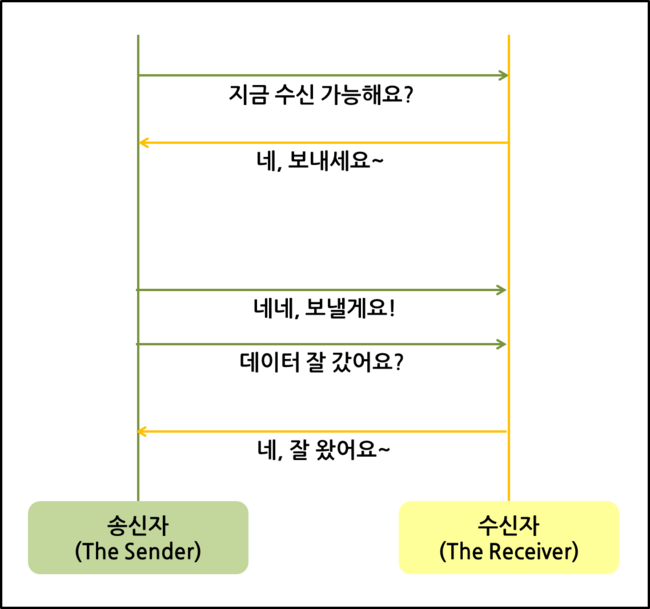
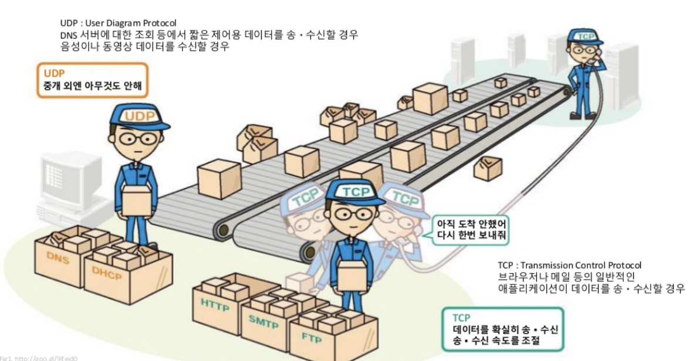
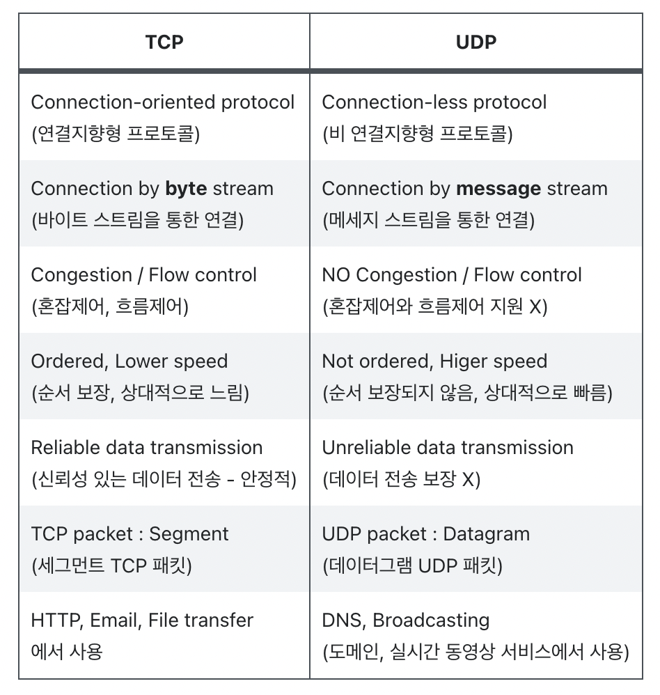

# UDP

# 한 문장 정리‼️

### UDP

**비연결형 서비스**로서, 패킷교환방식은 데이터그램 방식이며, 간단하게 데이터를 빠르게 보낼려고 할때 사용되는 프로토콜이다. 

- 도메인(DNS), 실시간 스트리밍 서비스(BroadCasting)에서 주로 사용

---

# 0. UDP 란?

- 일방적인 전송 프로토콜

- **간단한 데이터를 빠른 속도로 전송**하고자 하는 애플리케이션에서는 **UDP**를 사용( 신뢰성이 요구되지 않을 경우 )

# 2. UDP 개념

UDP(User Datagram Protocol)

- 전송계층의 비연결 지향적 프로토콜
- 비연결 지향적이란 데이터를 주고 받을 때 연결 절차를 거치지 않고 발신자가 일방적으로 데이터를 발신하는 방식.
- 연결 과정이 없기 때문에 TCP보다는 빠른전송을 할 수 있지만 데이터 전달의 신뢰성은 떨어짐.
- UDP는 발신자가 데이터 패킷을 순차적으로 보내더라도 **이 패킷들은 서로 다른 통신 선로를 통해 전달 될 수 있음**. 먼저 보낸 패킷이 느린 선로를 통해 전송될 경우 나중에 보낸 페킷보다 늦게 도착할 수 있음.
- 최악의 경우 잘못된 선로로 전송되어 유실될 수 있음.
    - 이럴 경우 중간에 패킷이 유실이나 변조가 되어도 재전송을 하지않음.

# 3. UDP 단점

- 데이터의 신뢰성이 없음.
- 의미있는 서버를 구축하기 위해서는 일일이 패킷을 관리해주어야 함.

# 4. UDP 특징

- 비연결형 서비스로 연결 없이 통신이 가능
- 데이터 경계를 구분함 (데이터그램 서비스)
- 정보를 주고 받을 때 정보를 보내거나 받는다는 신호절차를 거치지 않음.
- 신뢰성 없는 데이터를 전송
- **패킷 관리가 필요**
- 패킷 오버헤드가 적어 네트워크 부하가 감소되는 장점.
- 상대적으로 TCP보다 전송속도가 빠름.

# 5. UDP의 헤더정보

- 송신자의 포트번호
    - 크기: 16
    - 데이터를 보내는 어플리케이션의 포트 번호
- 수신자의 포트번호
    - 크기 : 16
    - 데이터를 받을 어플리케이션의 포트번호
- 데이터의 길이
    - 크기 : 16
    - UDP 헤더와 데이터의 총길이
- 체크섬(checksum)
    - 크기 : 16
    - 데이터 오류 검사에 사용

# 6. TCP vs UDP

---

### 참고문서

[TCP 와 UDP 차이를 자세히 알아보자](https://velog.io/@hidaehyunlee/TCP-와-UDP-의-차이)

[[Network] TCP / UDP의 개념과 특징, 차이점](https://coding-factory.tistory.com/614)
