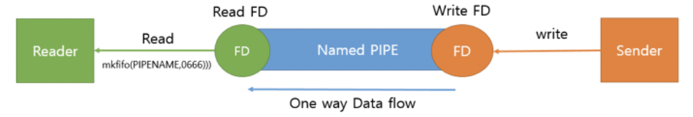
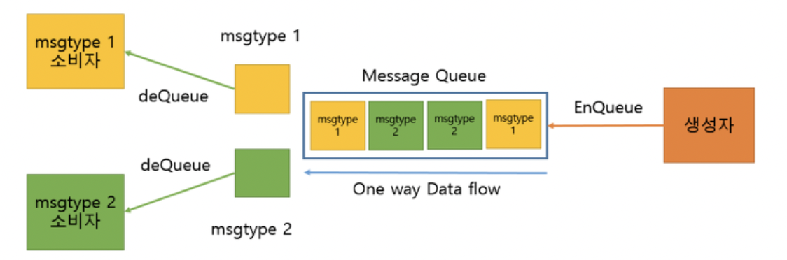

# IPC(Inter Process Communication)

# 한 문장 정리‼️

### 프로세스간 통신 (IPC)

프로세스들 사이에 서로 데이터를 주고 받는 행위 또는 그에 대한 방법이나 경로를 뜻합니다

---

# 0. 왜 IPC가 필요할까?

프로세스의 동작 원리

- 운영체제에서 프로그램은 여러 프로세스 단위(실제로 스레드 단위)로 데이터 처리가 진행됨.
- 이 때 각각의 프로세스는 서로 다른 독립적인 메모리 공간을 가지고 있음.
- 하지만 하나의 프로세스가 작업을 처리할 때 **다른 프로세스의 자원이 필요한 경우**가 있는데 독립적으로 분리된 메모리는 해당 프로세스가 **다른 프로세스의 자원에 접근하는 것을 불가능**하게 만듬.


위험한 띵킹 → 메모리를 접근 가능하도록 OS가 설정을 만들면 되지 않나?

- 다른 프로세스 메모리 공간에 직접적인 접근을 제한하지 않으면
- 해커가 만든 악성 프로세스가 접근 가능함.

그래서~! IPC 프로세스 간 통신이 필요함! 

# 1. IPC 종류

- PIPE
- Named PIPE
- Message Queue
- Shared Memory
- Memory Map
- Socket

# 2. IPC 별 사용 시기 및 특징


# 3. IPC 별 세부 설명

### 1) PIPE (파이프)

- 정의
    - 익명의 PIPE를 통해서 동일한 PPID를 가진 프로세스들 간에 단방향 통신을 지원
- 구조
    - FIFO 구조 (선입선출) → QUEUE
    - 생성된 PIPE에 대하여 Write 또는 Read만 가능  → **반이중 특징 : 송수신이 동시에 이루어지지 않음.**
- 사용 시기
    - 부모 자식 프로세스간 통신 할때 사용
- 유의사항
    - 쌍방 통신을 위해서는 Write용 PIPE 하나, Read PIPE 하나 씩 만들어야 함.
    - read()와 write()가 기본적으로 block 모드로 작동하기 때문에 프로세스가 read 대기 중이라면 read가 끝나기 전에는 write를 할수가 없게 됨.
- 도식화


- 코드

```c
#include <stdio.h>
#include <unistd.h>
#include <string.h>
#include <sys/types.h>

int main(void) {
  int     fd[2], nbytes, rc = 0;
  pid_t   childpid;
  char    string[] = "Hello, world!\n";
  char    readbuffer[80];

  if ((rc = pipe(fd)) < 0) {
    printf("Creating Pipe is Error [%d]\n", rc);
  }

  if((childpid = fork()) == -1) {
    perror("fork");
    return 0;
  }

  if (childpid == 0) {
    /* 자식 프로세스는 Write할꺼기에 Read FD는 닫아준다 */
    close(fd[0]);

    /* Pipe에 메시지 보내기 */
    write(fd[1], string, (strlen(string)+1));
    return 0;
  } else {
    /* 부모 프로세스는 Read할꺼기에 Write FD는 닫아준다 */
    close(fd[1]);

    /* Pipe에서 메시지 읽기 */
    nbytes = read(fd[0], readbuffer, sizeof(readbuffer));
    printf("Received Parent string: %s [%d]", readbuffer, nbytes);
  }

  return 0;
}
```

### 2) Named PIPE

- 정의
    - 이름을 가진 PIPE를 통해서 프로세스들 간에 단방향 통신을 지원
    - 서로 다른 프로세스들이 PIPE의 이름만 알면 통신이 가능함.
- 구조
    - FIFO 구조 → Queue 구조
    - 생성된 PIPE에 대해 Write 또는 Read만 가능 → **반이중 특징 : 송,수신이 동시에 이루어지지 않음.**
- 사용 시기
    - 연관이 전혀 없는 프로세스간에 통신을 할때
- 유의사항
    - 쌍방 통신을 위해서는 Write용 PIPE 하나, Read PIPE 하나 씩 만들어야 함.
    - read()와 write()가 기본적으로 block 모드로 작동하기 때문에 프로세스가 read 대기 중이라면 read가 끝나기 전에는 write를 할수가 없게 됨.
- 도식화



- 코드
- **Client(Writer)**

```c
#include <fcntl.h>
#include <sys/stat.h>
#include <unistd.h>
#include <stdio.h>
#include <stdlib.h>

#define MSG_SIZE 80
#define PIPENAME "./named_pipe_file"

int main(void) {
  char msg[MSG_SIZE];
  int fd;
  int nread, i;

  /* named pipe 열기, Write 전용으로 열기 */
  if ((fd = open(PIPENAME, O_WRONLY)) < 0) {
    printf("fail to open named pipe\n");
    return 0;
  }

  /* Data를 보낸다. */
  for (i = 0; i < 3; i++) {
    snprintf(msg, sizeof(msg), "Send Message[%i]", i);
    if ((nread = write(fd, msg, sizeof(msg))) < 0 ) {
      printf("fail to call write()\n");
      return 0;
    }
  }
  return 0;
}
```

- **Server(reader)**

```c
#include <fcntl.h>
#include <sys/stat.h>
#include <unistd.h>
#include <stdio.h>
#include <stdlib.h>

#define MSG_SIZE 80
#define PIPENAME "./named_pipe_file"

int main(void) {
  char msg[MSG_SIZE];
  int fd;
  int nread, rc;

  /* 기존에 named pipe가 있으면 삭제 */
  if (access(PIPENAME,F_OK) == 0) {
    unlink(PIPENAME);
  }

  /* named pipe 생성하기 */
  if ((rc = mkfifo(PIPENAME,0666)) < 0) {
    printf("fail to make named pipe\n");
    return 0;
  }

  /* named pipe 열기, Read Write가능 해야 한다 */
  if ((fd = open(PIPENAME, O_RDWR)) < 0) {
    printf("fail to open named pipe\n");
    return 0;
  }

  while (1) {
    if ((nread = read(fd, msg, sizeof(msg))) < 0 ) {
      printf("fail to call read()\n");
      return 0;
    }
    printf("recv: %s\n", msg);
  }
  return 0;
}
```

### 3) Message Queue

- 정의
    - 메모리를 사용한 PIPE
    - 구조체 기반으로 통신을 함.
- 구조
    - FIFO 구조
    - msgtype에 따라 다른 구조체를 가져올 수 있음.
- 사용시기
    - 프로세스간 다양한 통신을 할 때 사용 할 수 있음.
- 유의사항
    - 커널에서 제공하는 Message queue 이기 때문에 EnQueue 하는데 제한이 존재 함.
- 도식화




- 코드
- **Message_Queue_Constructer**

```c
#include <stdio.h>
#include <string.h>
#include <unistd.h>
#include <sys/types.h>
#include <sys/ipc.h> 
#include <sys/msg.h> 
#include <sys/stat.h> 

struct msgbuf
{
  // 이부분은 고정!!!!
  long msgtype;      
  // 아래 부분은 모두 변경 가능
  char mtext[256];  
  char myname[16];
  int  seq;
};

struct msgbuf1
{
  // 이부분은 고정!!!!
  long msgtype;      
  // 아래 부분은 모두 변경 가능
  char ip[128];  
  char host[16];
  int  seq;
};

int main(void)
{
  key_t key_id;
  int i;
  struct msgbuf mybuf;
  struct msgbuf1 mybuf1;

  // 1. Message Queue 할당.
  key_id = msgget((key_t)1234, IPC_CREAT|0666);
  if (key_id == -1)
  {
    perror("msgget error : ");
    return 0;
  }
  // 2. 할당된 ID 확인
  printf("Key is %d\n", key_id);

  mybuf.seq = 0;
  i = 0;
  while (1) {
    memset(&mybuf, 0, sizeof(struct msgbuf));
    memset(&mybuf1, 0, sizeof(struct msgbuf1));

    // 짝수일경우 메시지 타입이 4
    // 홀수일경우에는 메시지 타입이 3
    if (i % 2 == 0) {
      mybuf.msgtype = 4;
      snprintf(mybuf.mtext, sizeof(mybuf.mtext), "hello [%d]",i);
      snprintf(mybuf.myname, sizeof(mybuf.myname), "name [%d]",i);
      mybuf1.seq = i;
      mybuf.seq = i;
      // 3. 메시지를 전송한다. 
      if (msgsnd( key_id, (void *)&mybuf, sizeof(struct msgbuf), IPC_NOWAIT) == -1)
      {
        perror("msgsnd error : ");
        return 0;
      } 
    } else {
      mybuf1.msgtype = 3;
      snprintf(mybuf1.ip, sizeof(mybuf1.ip), "10.0.8.%d",i);
      snprintf(mybuf1.host, sizeof(mybuf1.host), "ip[%d]",i);
      mybuf1.seq = i;
      // 3. 메시지를 전송한다. 
      if (msgsnd( key_id, (void *)&mybuf1, sizeof(struct msgbuf1), IPC_NOWAIT) == -1)
      {
        perror("msgsnd error : ");
        return 0;
      } 
    }

    printf("send %d\n", i);
    i++;
    sleep(1);
  }
  return 0;
}
```

- **Message_Queue_Consumer**

```c
#include <stdio.h>
#include <sys/types.h> 
#include <sys/ipc.h> 
#include <sys/msg.h> 
#include <sys/stat.h> 

struct msgbuf {
 // 이부분은 고정!!!!
    long msgtype;
    // 아래 부분은 모두 변경 가능
    char mtext[256];
    char myname[16];
    int  seq;
};

struct msgbuf1 {
  // 이부분은 고정!!!!
  long msgtype;      
  // 아래 부분은 모두 변경 가능
  char ip[128];  
  char host[16];
  int  seq;
};

int main(int argc, char **argv)
{
    key_t key_id;
    struct msgbuf mybuf;
    struct msgbuf1 mybuf1;

    int msgtype;//전역변수로 빼야 됩니다.

    // 아규먼트가 있을경우 msgtype 가 3인 메시지를 받아오고(홀수) 
    // 아규먼트가 없을경우 msgtype 가 4인 메시지를 받아온다(짝수)  
    if (argc == 2)
        msgtype = 3;
    else 
        msgtype = 4;

    key_id = msgget(1234, IPC_CREAT|0666);
    if (key_id < 0) {
        perror("msgget error : ");
        return 0;
    }
    while(1) {
      if (msgtype == 3) {
        if (msgrcv( key_id, (void *)&mybuf1, sizeof(struct msgbuf1), msgtype, 0) == -1)
        {
          perror("msgrcv error : ");
          return 0;
        }
        printf("%s %d\n",mybuf1.host, mybuf1.seq);
      } else {
        if (msgrcv( key_id, (void *)&mybuf, sizeof(struct msgbuf), msgtype, 0) == -1)
        {
          perror("msgrcv error : ");
          return 0;
        }
        printf("%s %d\n",mybuf.mtext, mybuf.seq);
      }
    }
    return 0;
}
```

### 4) Shared Memory

- 정의
    - 시스템 상의 공유 메모리를 통해 통신함.
- 구조
    - 일정한 크기의 메모리를 프로세스간에 공유하는 구조
    - 공유 메모리는 커널에서 관리됨.
- 사용 시기
    - 프로세스간 Read,Write를 모두 필요로 할 때
- 유의사항
    - 프로세스간의 사용할려면 메모리 크기가 동일해야 함.
- 도식화


### 5) Memory Map

- 정의
    - 파일을 프로세스의 메모리에 일정 부분 맵핑 시켜 사용함.
- 구조
    - 오픈된 파일에 한해서 메모리를 공유함.
        - 파일이 하나 열려 있으면 메모리 맵을 통해 존재하는지 확인하고 메모리에 해당 파일을 올릴지 말지 결정함.
- 사용시기
    - 파일로 대용량 데이터를 공유할 때 사용함.
    - FILE IO가 느릴 떄 사용하면 좋음.
    - 대부분 운영체제에서는 프로세스를 실행할 때 실행 파일의 각 세그먼트를 메모리에 사상하기 위해 메모리 맵 파일을 이용함.
- 유의사항
- write 시기는 프로세스의 페이지가 메모리에서 내려갈 때만 write됨.
    - 이거 때문에 메모리와 file sync 가 안맞을 수 있음.
- 도식화


```c
#include <stdio.h>
#include <stdlib.h>
#include <string.h>
#include <errno.h>
#include <sys/types.h>
#include <sys/stat.h>
#include <sys/mman.h>
#include <unistd.h>
#include <fcntl.h>
#include <sys/mman.h>

int main(int argc, char **argv) {
  int fd;
  char *file = NULL;
  struct stat sb;
  int flag = PROT_WRITE | PROT_READ;

  if (argc < 2) {
    fprintf(stderr, "Usage: input\n");
    return 0;
  }

  if ((fd = open(argv[1], O_RDWR|O_CREAT)) < 0) {
    perror("File Open Error");
    return 0;
  }

  if (fstat(fd, &sb) < 0) {
    perror("fstat error");
    return 0;
  }

  file = (char *)malloc(40);

  // mmap를 이용해서 열린 파일을 메모리에 대응시킨다.
  // file은 대응된 주소를 가리키고, file을 이용해서 필요한 작업을
  // 하면 된다.
  if ((file = (char *) mmap(0, 40, flag, MAP_SHARED, fd, 0)) == NULL) {
    perror("mmap error");
    return 0;
  }
  printf("%s\n", file);
  memset(file, 0x00, 40);
  munmap(file, 40);
  close(fd);
  return 0;
}
```

### 6) Socket

- 정의
    - 네트워크 소켓 통신을 사용한 데이터 공유
- 구조
    - 네트워크 소켓을 이용하여 Client - Server 구조로 데이터 통신
    - 데이터 교환을 위해 양쪽 PC에서 각각 임의의 포트를 정하고 해당 포트 간의 대화를 통해 데이터를 주고 받는 방식.
    - 각각 PC의 Port 를 담당하는 소켓은 각각 하나의 프로세스라고 생각하면 됨.
- 사용시기
    - 원격에서 프로세스간 데이터를 공유 할 때 사용
- 유의 사항
    - 네트워크 프로그래밍이 가능해야 함.
    - 데이터 세그먼트 처리를 잘해야 함.
- 도식화


---

### 참고자료

[[프로세스간 통신] IPC(inter process communication) 종류](https://doitnow-man.tistory.com/110)

[프로세스 간 통신 - 위키백과, 우리 모두의 백과사전](https://ko.wikipedia.org/wiki/프로세스_간_통신)

[IPC 통신(PIPE, Message, Shared, Memory Map, Socket, RPC)](https://bluemoon-1st.tistory.com/22)
