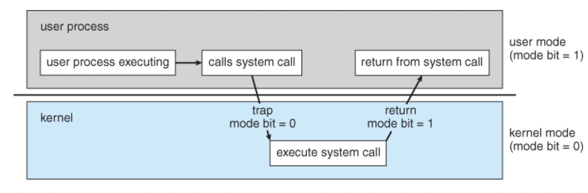
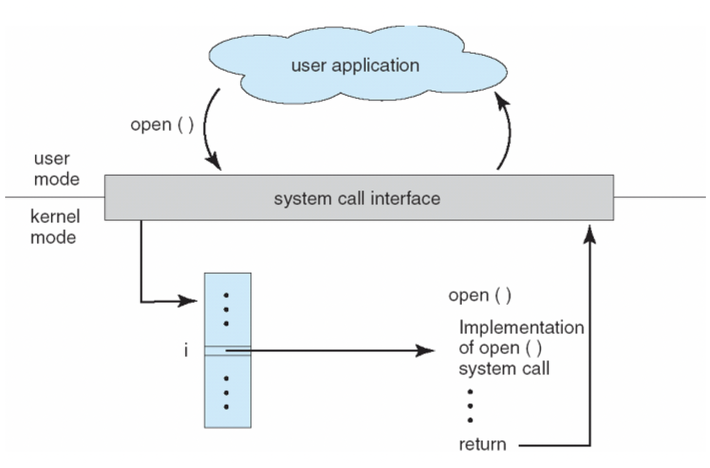

# 인터럽트(Interrupt)

# 한 문장 정리‼️

### 인터럽트

CPU가 프로그램을 실행하고 있을 때, **입출력 하드웨어** 등의 장치나 **예외상황**을 발생하여 처리가 필요한 경우에 **마이크로프로세서에게 알려 처리할 수 있도록 하는 것.**

---

# 0.Interrupt(인터럽트)

주변장치와 입출력 장치는 CPU나 메모리와 달리 **인터럽트**라는 메커니즘을 통해 관리됨.

### 왜?

그 이유는 입출력 연산이 CPU 명령 수행속도보다 현저히 느림.

입출력 연산 시 출력이 나올 때 까지 CPU 를 사용하면 효율적으로 CPU를 사용할 수 있음.

### 개념 및 종류

CPU가 프로그램을 실행하고 있을 때, 입출력 하드웨어 등의 장치나 예외상황을 발생하여 처리가 필요한 경우에 마이크로프로세서에게 알려 처리할 수 있도록 하는 것.

인터럽트는 크게 하드웨어 인터럽트 , 소프트웨어 인터럽트로 나뉨.

### 하드웨어 인터럽트

하드웨어가 발생시키는 인터럽트

- CPU가 아닌 다른 하드웨어 장치가 cpu에 어떤 사실을 알려주거나 서비스를 요청해야 할 경우 발생

### 소프트웨어 인터럽트

소프트웨어가 발생시키는 인터럽트

- 소프트웨어(사용자 프로그램)가 스스로 인터럽트 라인을 세팅
    - 예외 상황
    - system call
- 인터럽트를 발생시키기 위해 하드웨어, 소프트웨어는 cpu내에 있는 **인터럽트 라인**을 세팅하여 인터럽트를 발생시킴.
- cpu는 매번 명령을 수행하기 전에 인터럽트 라인이 세팅되어 있는지를 검사.

### 인터럽트 핸들러

실제 인터럽트를 처리하기 위한 루틴 → 인터럽트 서비스 루틴(Interrupt Servce Routine)

운영체제의 코드 영역에는 인터럽트 별로 처리해야할 내용이 이미 프로그램되어 있음.

### 인터럽트 벡터

인터럽트 발생시 처리해야 할 인터럽트 핸들러의 주소를 인터럽트 별로 보관하고 있는 테이블.

### PCB(Process Control Block)

커널의 데이터 영역에 존재하며 각각의 프로세스마다 고유의 PCB가 있음.

인터럽트 발생 시 프로세스의 어느 부분이 수행중이었는지를 저장함.

# 1. 인터럽트 과정

process A 실행 중 디스크에서 어떤 데이터를 읽어오라는 명령을 받았을 때.

- process A는 **system call**을 통해 인터럽트를 발생시킴.
- CPU는 현재 진행 중인 **기계어 코드를 완료**함.
- 현재까지 수행중이었던 상태를 해당 process의 **PCB(Process Control Block)**에 저장함. (수행중이던 MEMORY주소, 레지스터 값, 하드웨어 상태 등...)
- PC(Program Counter, IP)에 다음에 실행할 명령의 주소를 저장함.
- 인터럽트 벡터를 읽고 ISR 주소값을 얻어 **ISR(Interrupt Service Routine)**로 점프하여 루틴을 실행함.
- 해당 코드를 실행함.
- 해당 일을 다 처리하면, 대피시킨 레지스터를 복원함.
- ISR의 끝에 **IRET 명령어**에 의해 인터럽트가 해제 됨.
- IRET 명령어가 실행되면, 대피시킨 **PC 값을 복원**하여 이전 실행 위치로 복원함.

# 2. 인터럽트 명령

CPU가 수행하는 명령에는 **일반 명령**과 **특권 명령**이 있음.

일반 명령 : 메모리에서 자료를 읽어오고, CPU에서 계산을 하는 등의 명령이고 모든 프로그램이 수행할 수 있음.

특권 명령 : 보안이 필요한 명령으로 입출력 장치, 타이머 등의 장치를 접근하는 명령. 특권 명령은 항상 **운영체제** 만이 수행할 수 있음.

### kernel mode vs user mode

운영체제는 **하드웨어적인 보안을 유지하기** 위해 기본적으로 **operation**을 지원.

**kernel mode**

- 운영체제가 CPU의 제어권을 가지고 명령을 수행하는 모드로 **일반 명령**과 **특권 명령** 모두 수행할 수 있음.

**user mode**

- 일반 사용자 프로그램이 CPU제어권을 가지고 명령을 수행하는 모드이기 때문에 **일반 명령**만을 수행할 수 있다.

### 인터럽트 명령 관점의 과정

process A가 프로그램 명령 수행중에 **디스크 입출력 명령을 읽은 경우** 

- 사용자 프로그램은 입출력 장치에 접근하는 명령을 수행할 수 없음.
    - user mode에서 특권 명령을 수행할 수 없기 때문.
- 이련 경우에 사용자 프로그램은 운영체제에게 **시스템 콜**을 통해 **특권명령**을 대신 수행해달라고 요청함.
    - **시스템 콜**은 주소 공간 자체가 다른 곳(커널의 code영역)으로 이동해야 하므로 **프로그램이 인터럽트 라인에 인터럽트를 세팅**하는 명령을 통해 이루어짐.
    - **시스템 콜**은 커널 영역의 기능을 **사용자 모드가 사용 가능**하게, 즉 프로세스가 **하드웨어에 직접 접근해서 필요한 기능을 사용**할 수 있게 해준다.

CPU가 **인터럽트 라인을 검사**하고 **인터럽트가 발생한 것을 감지**하게 된다. 

현재 수행중인 사용자 프로그램을 잠시 멈추고 CPU의 제어권을 운영체제에게 양도한다. 

(kernel mode) 그리고 이 때 하드웨어적으로 **모드 비트가 1에서 0으로** 자동으로 세팅되어 특권 명령을 수행할 수 있게 된다.⁉️

- 하드웨어에 **모드 비트(mode bit)를 추가해서** 각 모드를 표시
    - 사용자 모드 : 1
    - 커널 모드 : 0
- 이렇게 사용자 모드 , 커널 모드 로 구분하고 모드 비트를 통해 모드를 표시하는 것이 **이중 연산 모드**(dual-mode operation)이라고 함.
    - **OS 영역의 안전**과 **적절한 동작**을 위한 **보호 장치**

**user mode → kernal mode 과정** 

---

# 참고 자료

[[OS기초] 인터럽트 제대로 이해하기](https://velog.io/@adam2/%EC%9D%B8%ED%84%B0%EB%9F%BD%ED%8A%B8)

[OS - 이중 연산 모드(dual-mode operation)](https://m.blog.naver.com/PostView.nhn?blogId=4717010&logNo=60210905703&proxyReferer=https:%2F%2Fwww.google.com%2F)