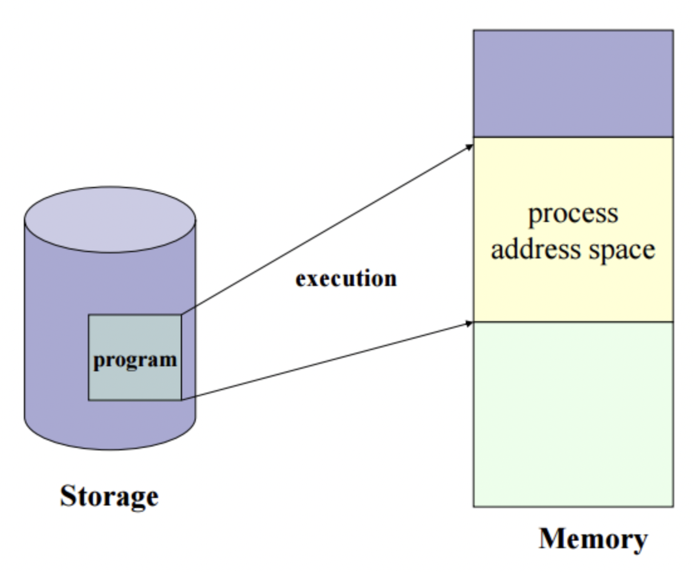
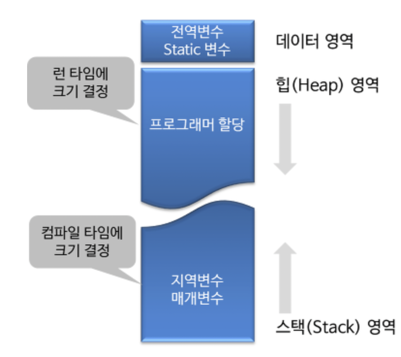
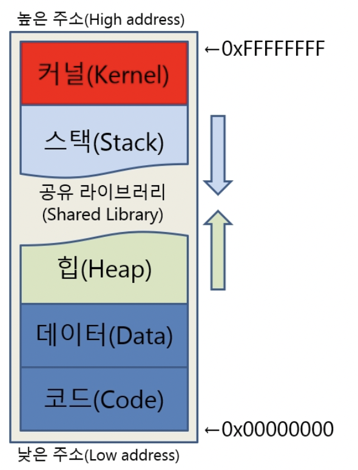
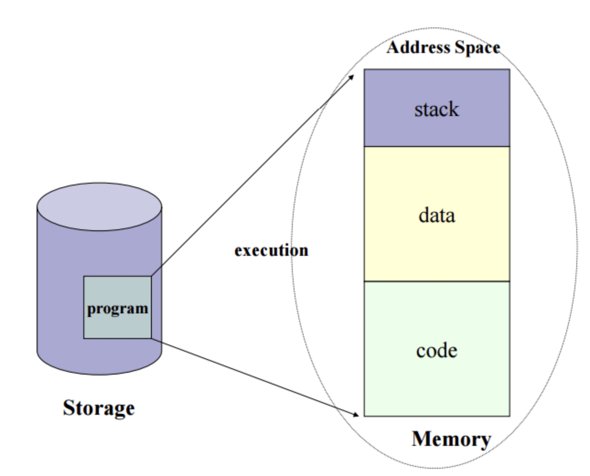
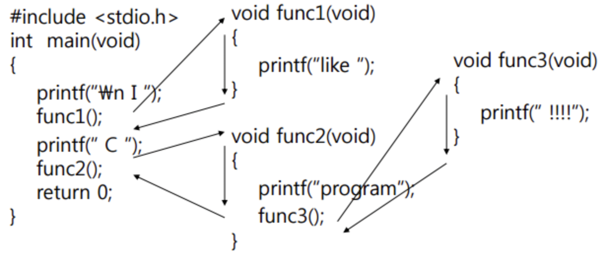
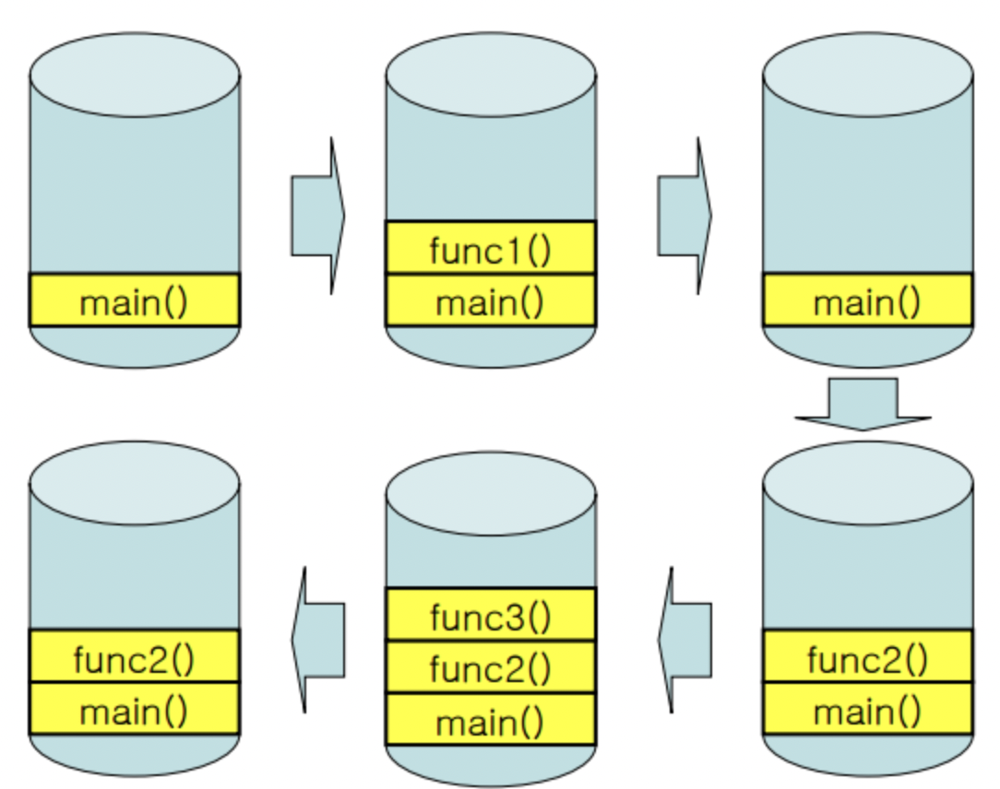

# 프로세스 주소 공간

# 한 문장 정리‼️

### 프로세스 주소 공간

: 프로그램이 **실행**되면 **메모리에 할당**되는 것.

---

# 0. 프로세스 주소 공간(Process Address Space)

프로그램이 실행되면 해당 프로세스에 할당된 메모리 공간을 의미함.

### 구성요소

1. Code Segment
    - 프로그램의 코드가 저장되어 있음.
    - 프로그램의 코드는 바뀌어서는 안되므로 **읽기만 가능**함.
2. Data Segment 
    - **전역변수** 같은 데이터가 저장되어 있음.
    - 함수 바깥에 있는 데이터를 저장함.
    - 변수는 변할 수 있으므로 **읽고 쓰기**가 가능함.
    - **컴파일 타임에 크기 결정**
3. Stack Segment 
    - **함수**나 **지역 변수**가 저장되어 있음.
    - 변수는 변할 수 있으므로 **읽고 쓰기**가 가능함.
    - LIFO(First Input Last Out : 선입후출)
    - 매우 빠른 액세스
    - 다른 영역들과 달리 높은 주소에서 낮은 주소로 자라나는 형태를 가짐.
        - 이유는 스택 영역이 운영체제의 핵심인 커널영역을 침범할 수 없기 때문임.
        - 스택영역이 엄청 커지더라도 커널영역을 침범하지 않을 수 있음.
        - 다른 이유는 스택영역과(높은 주소→낮은 주소) 힙영역(낮은 주소에서 높은 주소)이 공간을 공유하면서 사용하게 되면 공간을 효율적으로 사용할 수 있음.
4. Heap Segment
    - 프로그래머가 **동적으로 메모리를 할당**할 수 있는 영역.
    - **런 타임에 크기 결정**
    - 본질적인 범위가 **전역**임
    - (상대적으로) 느린 액세스
        - 포인터로 메모리 영역에 접근해야 하기 때문임.
    - 언어에 따른 메모리 할당
        - C언어 : malloc()을 사용하여 할당.
        - JAVA : new 키워드를 사용하여 할당.
    - 언어에 따른 메모리 해제
        - C언어 : 직접 관리해서 해제 시켜야됨. → free()
        - Java: 가비지 컬렉션에 의해 사용되지 않을 때 자동 해제
    - 만약 메모리 해제를 하지 않으면 메모리 누수(memory leak)가 발생.

### Address Space

### Code

### Stack

### Code 부분 존재 이유

- 코드는 프로그램이 만들어지고 나서는 바뀌지 않기 때문에 `Read Only` 임.
- 같은 프로그램이라면 여러 프로세스가 실행되더라도 **코드 부분은 모두 같음.**
- 따라서 같은 프로그램의 **프로세스**인 경우 **코드 부분을 공유하여** 메모리 사용량을 줄일 수 있음.

### Stack 부분과 DATA 부분 존재 이유

- **함수의 Stack 구조**로 인해 Stack 부분이 존재함.
- 전역변수는 어떤 함수에서도 접근할 수 있기 때문에 **Data**로 **따로 관리**해줌.

### Heap 부분 존재 이유

- 할당해야 할 메모리의 크기를 프로그램이 실행되는 동안 결정해야 하는 경우**(Run Time) 유용하게 사용 되는 공간**임.
- 컴파일 타임에는 사용자의 입력을 모르기에 먼저 데이터공간을 할당하면 공간효율성이 떨어지게 됨.

---

# 참고 자료

[[OS] 프로세스의 주소 공간](https://velog.io/@emily0_0/OS-%ED%94%84%EB%A1%9C%EC%84%B8%EC%8A%A4%EC%9D%98-%EC%A3%BC%EC%86%8C-%EA%B3%B5%EA%B0%84)

[메모리 구조 [Memory Structure]](https://hdacker.tistory.com/6)