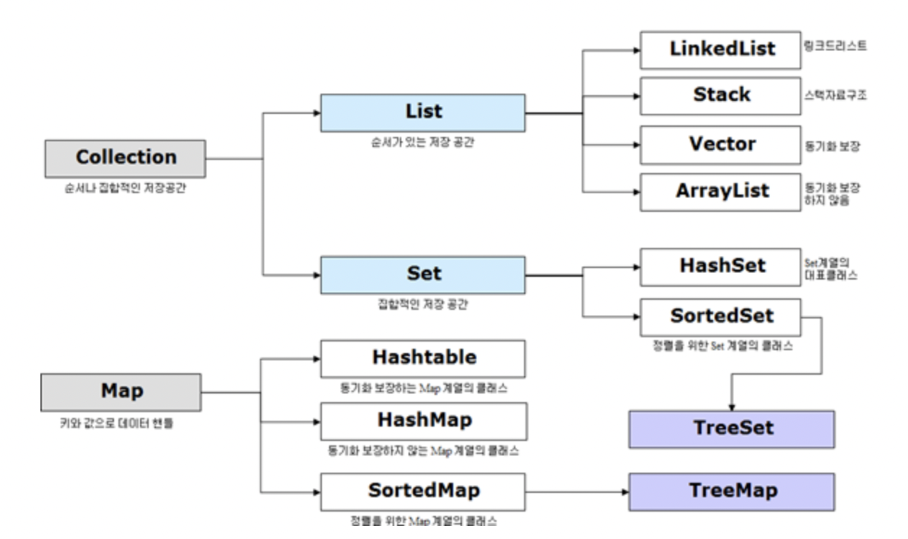

# Collection

# 한 문장 정리‼️

### Collection

Java에서 자료구조를 의미하며, JCF가 이를 구현하는 클래스를 정의하는 인터페이스를 제공합니다.

---

# 0. Java Collection Framework(JCF)

Java에서 컬렉션(Collection)이란 데이터의 집합 ,그룹을 의미함.

JCF(Java Collection Framework)는 이러한 데이터, 자료구조인 컬렉션과 **이를 구현하는 클래스를 정의하는 인터페이스**를 제공함.

# 1. JCF 상속 구조

Collection 인터페이스는 List, Set, Queue로 3가지 상위 인터페이스로 분류함.

Map은 Collection 인터페이스를 상속받고 있지 않지만 Collection으로 분류됨.

# 2. Collection 인터페이스 특징

- List (인터페이스)
    - LinkedList, Vector, ArrayList (구현 클래스)
        - 순서가 있는 데이터의 집합으로 데이터의 중복을 허용함.
        - LinkedList
            - **양방향 포인터 구조**로 데이터의 삽입, 삭제가 빈번할 경우 데이터의 위치정보만 수정하면 되기에 유용
            - 스택, 큐, 양뱡향 큐 등을 만들기 위한 용도로 쓰임.
        - Vector
            - 과거에 대용량 처리를 위해 사용했으며, 내부에서 자동으로 **동기화처리**가 일어나 비교적 성능이 좋지 않고 무거워 잘 쓰이지 않음
        - ArrayList
            - 단방향 포인터 구조로 각 데이터에 대한 인덱스를 가지고 있어 **조회 기능**에 성능이 뛰어남
- Queue (인터페이스)
    - LinkedList, PriorityQueue (구현 클래스)
        - List와 유사
- Set (인터페이스)
    - HashSet, TreeSet (구현 클래스)
        - 순서를 유지하지 않는 데이터의 집합으로 데이터의 중복을 허용하지 않음.
        - HashSet
            - 가장 빠른 임의 접근 속도
            - 순서를 예측할수 없음
        - TreeSet
            - 정렬방법을 지정할 수 있음.
- Map (인터페이스)
    - Hashtable, HashMap, TreeMap (구현 클래스)
        - 키(Key), 값(Value)의 쌍으로 이루어진 데이터 집합으로, 순서는 유지되지 않으며 키(Key)의 중복을 허용하지 않으나 값(Value)의 중복은 허용함.
        - Hashtable
            - HashMap보다는 느리지만 동기화 지원
            - null 불가
        - HashMap
            - 중복과 순서가 허용되지 않으며 null 값이 올 수 있음.
        - TreeMap
            - 정렬된 순서대로 키(Key)와 값(Value)을 저장하여 검색이 빠름.

---

### 참고 사이트

[[JAVA] Java 컬렉션(Collection) 정리](https://gangnam-americano.tistory.com/41)
