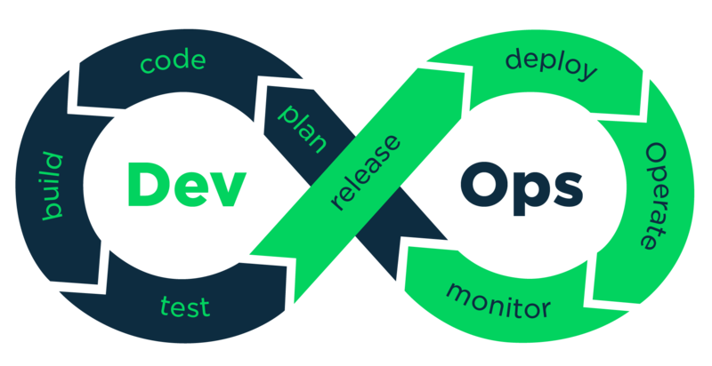
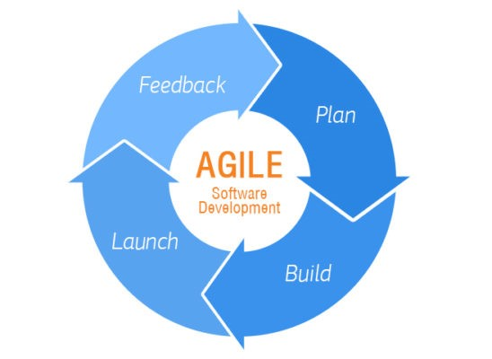
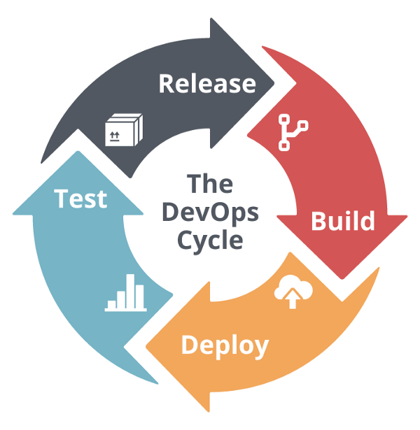

# 데브옵스(DevOps)

# 한줄 정리‼️

---

### Development + Operation

; **개발**담당자와 **운영**담당자가 연계하여 협력하는 **개발 방법론** 

**애자일 방법론**(Agile)을 통해 잦은 변화에 신속하게 대처할 수 있고, **지속적인 통합**(Continous Integration)을 통해 배포 시간을 단축시킬 수 있음.

→ 경쟁 시장에서 우위를 차지하는데 유리한 개발 방법론! 

# 0. 데브옵스(DevOps)란?

---

Development + Operation ; **개발**담당자와 **운영**담당자가 연계하여 협력하는 개발 방법론 

데브옵스(DepOps)는 개발(development)과 운영(operation)을 결합해 탄생한 개발 방법론입니다. 

다른 말로는 **시스템 개발자**와 **운영을 담당하는 정보기술 전문가** 사이의 **소통, 협업, 통합** 및 **자동화**를 강조하는 소프트웨어 개발 방법론 입니다.

이러한 데브옵스의 개념은 **애자일 소프트웨어(Agile software)** 개발과 지**속적인 통합(Continuous Integration)** 등의 개념과도 관련이 있음. 

cf)

소프트웨어 개발 방법론에는 여러가지 방법이 있다.

- WaterFall 방법론
- Agile 방법론
- Scrum 방법론
- DevOps 방법론

### 1) 애자일(Agile) 방법론

---

; Agile software development 

; 애자일 개발 프로세스 

; 익스트림 프로그래밍, 스크럼, 크리스털 패밀리, 익스트림 모델링 

; 계획과 문서를 기반으로 개발 모형이나 모델에 따라 앞을 예측하며 개발하는 것이 아니라, → **폭포수 방법론(WaterFall 방법론)** → 대기업에서 많이 쓰임. 

 실질적인 코딩을 기반으로 일정한 주기에 따라 계속적으로 **프로토타입을 형성**하고 **필요한 요구사항을 파악**하며 이에 따라 **즉시 수정사항을 적용**하여 결과적으로 하나의 큰 소프트웨어를 개발하는 **적응형 개발 방법** 

### 2) 지속적인 통합 ( Continuous Integration )

---

; 개발 초기부터 **실행이 가능한 상태**로 **코드를 유지**하는 것 

; **퀄리티 컨트롤**을 적용하는 프로세스

소프트웨어의 **질적 향상**과 소프트웨어를 **배포하는데 걸리는 시간을 줄임.**

- 코드를 수정하고 브랜치(RELEASE,DEV)에 반영하고 싶을 때
    - build test를 통해 통과되었을 경우에만 반영함.
    - 통과되지 못한 경우엔 기존 코드 유지.
- **빌드 과정에서 오류가 없어야지만** 버전 업을 할 수 있기에 보다 더 **소프트웨어의 질적 향상**을 기대할 수 있고, 소프트웨어를 **배포하는데 걸리는 시간을 줄일** 수 있음.

### DevOps 정리

---

데브옵스(DepOps)는 쉽게 말해 개발부서와 운영부서간의 원활한 소통을 기반으로 함 .

- 개발 부서에서 웹사이트 **개발**, 앱 **개발**, 그리고 알고리즘 **개발**을 한다면
- 운영부서에서는 **개발된 아이템**이 **고객에게 잘 전달**되도록 하는 부서
    - 운영팀에서 고객의 수요에 맞춰 서버와 데이터베이스를 관리하는 일을 통해 서비스가 제대로 돌아갈 수 있는 환경을 개발팀에게 제공.

# 1. 데브옵스 DepOps의 이점

---

### 🚀속도

- 작업 속도가 빨라지면서 시장 **변화에 더 잘 적응**하고 효율적으로 비즈니스 성과를 창출할 수 있음.

### 🤾신속한 제공

- 새로운 기능의 **릴리스**와 **버그 수정** 속도가 **빨라질수록** 경쟁 우위를 차지할 수 있음.

### 🐢안정성

- 애플리케이션 업데이트와 인프라 변경의 **품질 보장**, **지속적 통합** 및 **지속적 전달**과 같은 방식을 통해 **변경 사항이 제대로 안전하게 작동**하는지 테스트 가능

### 🕸️확장 가능

- 규모에 따라 **인프라**와 **개발 프로세스 운영**, **관리** 가능

### 👯협업 강화

- 개발자와 운영 부서 간의 **협력**을 통해 **효과적인 팀 구축 가능**

### 🔐보안

- **자동화된** 규정 준수 정책, **세분화**된 제어 및 구성관리 기술 사용 가능

### 참고문서

---

[데브옵스 DevOps란 무엇일까요?](https://m.blog.naver.com/acornedu/221519913222)

[[ISSUE] 소프트웨어 개발 방법론, WaterFall 방법론](https://issac-min.tistory.com/9)

[컴파일과 빌드 차이점](https://freezboi.tistory.com/39)
