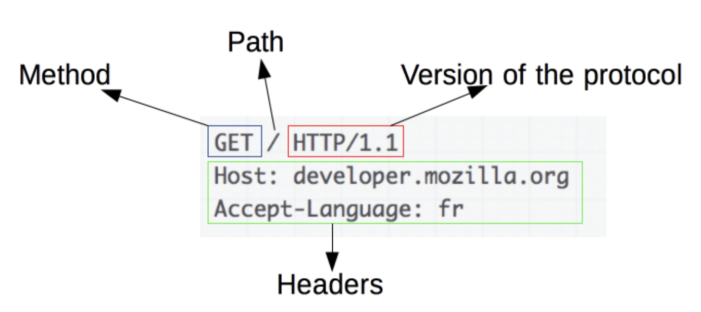
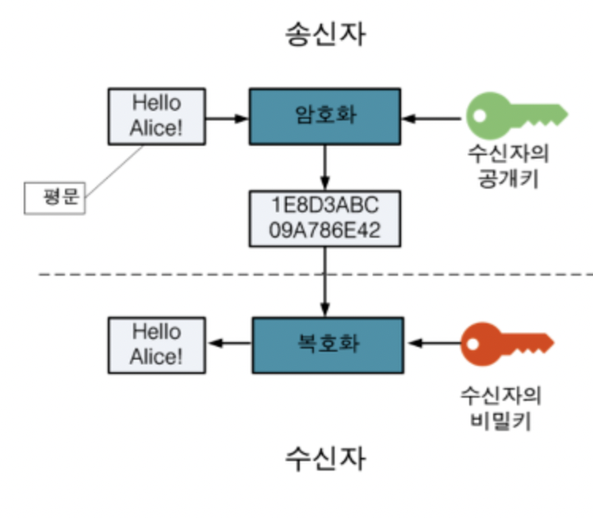
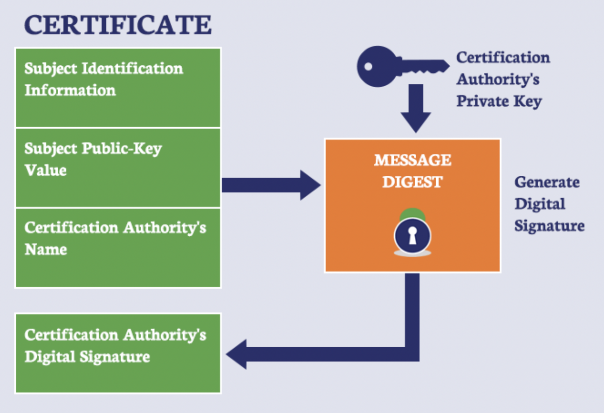

# HTTP & HTTPS

# 한 문장 정리‼️

HTTP 는 데이터를 주고 받기 위한 프로토콜로 평문의 데이터를 송수신하기 때문에 보안의 문제가 발생함.

그래서 이를 해결하기 위해서 **공개키 암호화 방식**으로 보안성을 높인 것이 HTTPS 임.

---

# 0. HTTP란?

HTTP(Hyper Text Transfer Protocol)이란 **서버/ 클라이언트 모델을 따라 데이터를 주고 받기 위한 프로토콜**

즉, HTTP는 인터넷에서 하이퍼텍스트를 교환하기 위한 통신 규약으로, 80번 포트를 사용.

따라서 HTTP 서버가 80번 포트에서 요청을 기다리고 있으며, 클라이언트는 80번 포트로 요청을 보내게 됨.

HTTP 는 1989년 팀 버너스 리(Tim Berners Lee)에 의해 처음 설계 되고, WWW(World-Wide-Web)기반에서 세계적인 정보를 공유하는데 큰 역할을 함.

### HTTP 구조

HTTP는 애플리케이션 레벨의 프로토콜로 TCP/IP 위에서 작동함. HTTP는 상태를 가지고 있지 않은 Stateless 프로토콜이며, Method, Path, Version, Headers, Body 등으로 구성 됨.

하지만 HTTP는 암호화가 되지 않은 평문 데이터를 전송하는 프로토콜이였기 때문에, HTTP로 비밀번호나 주민등록번호 등을 주고 받으면 제3자가 정보를 조회할 수 있었음. 이러한 문제를 해결하기 위해 HTTPS가 등장함.

# 1. HTTPS란?

HTTP(Hyper Text Transfer Protocol Secure)란 **HTTP에 데이터 암호화가 추가된 프로토콜**임.

HTTPS는 HTTP와 다르게 433번 포트를 사용하며, 네트워크 상에서 중간에 제3자가 정보를 볼 수 없도록 **공개키 암호화를** 지원함.

### HTTPS의 동작 과정

HTTPS는 SSL과 같은 프로토콜을 사용하여 공개키/개인키 기반으로 데이터를 암호화함.

데이터는 암호화되어 전송되기 떄문에 임의의 사용자가 데이터를 조회하여도 원본의 데이터를 보는 것은 불가능함.

그렇다면 **서버는** 클라이언트가 요청을 보낼 때 암호화를 하기 위한 **공개키를 생성**해야 하는데, "일반적으로 인증된 기관(Certificate Authority)에 공개키를 전송하여 인증서를 발급받음"

1. A기업이 HTTP 기반의 애플리케이션에 HTTPS를 적용하기 위해 공개키/개인키를 발급.
2. CA 기업에 돈을 지불하고, 공개키를 저장하는 인증서를 발급을 요청함.
3. CA 기업은 CA기업의 이름, 서버의 공개키, 서버의 정보 등을 기반으로 인증서를 생성하고, CA 기업의 개인키로 암호화하여 A기업에 이를 제공
4. A기업은 클라이언트에게 암호화된 인증서를 제공함.
5. 브라우저는 CA 기업의 공개키를 미리 다운받아 갖고 있어, 암호화된 인증서를 복호화함.
6. 암호화된 인증서를 복호화하여 얻은 A기업의 공개키로 데이터를 암호화하여 요청을 전송함.

# 2. HTTP와 HTTPS

HTTP는 암호화가 추가되지 않았기 때문에 **보안에 취약**한 반면, HTTPS는 안전하게 데이터를 주고받을 수 있음.

하지만 HTTPS를 이용하면 암호화/복호화의 과정이 필요하기 때문에 HTTP보다 속도가 느림. → 사실 별 차이 없음 이제

또한 HTTPS는 인증서를 발급하고 유지하기 위한 추가 비용이 발생

**그렇다면 언제 HTTP를 쓰고, 언제 HTTPS를 쓰는 것이 좋겠는가?**

개인 정보와 같은 민감한 데이터를 주고 받아야 한다면 HTTPS를 이용해야 하지만, 단순한 정보 조회 등만을 처리하고 있다면 HTTP를 이용하면 됨.

---

### 참고자료

[[Web] HTTP와 HTTPS 및 차이점](https://mangkyu.tistory.com/98)
