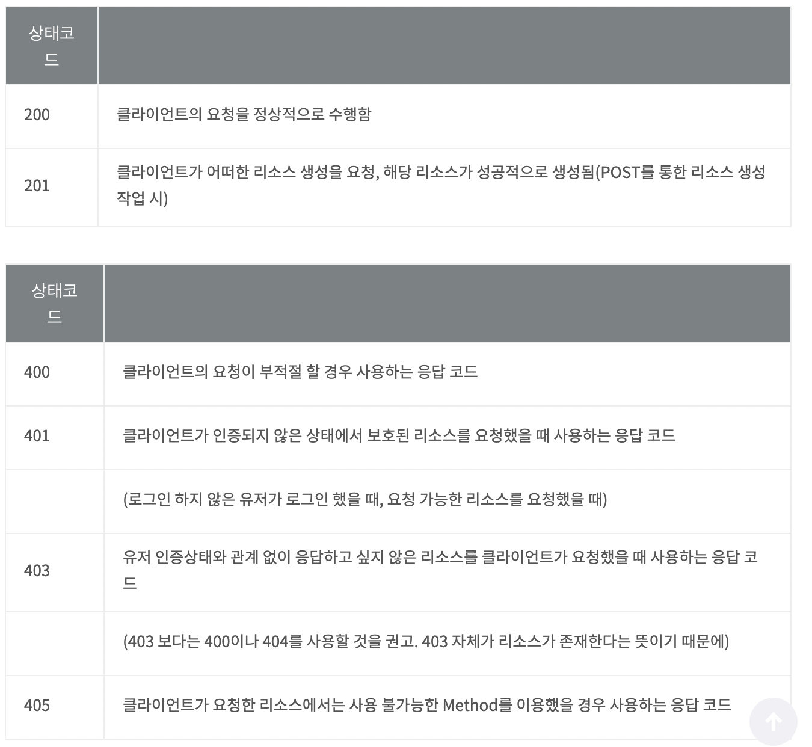
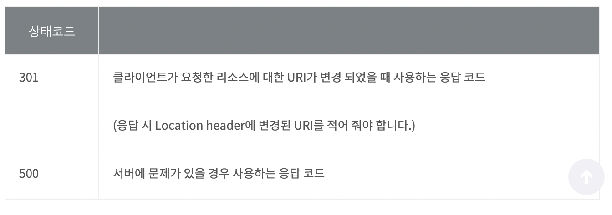

# RESTFul API 란?

# 한 문장 정리‼️

### REST API 란?

rest API는 http 통신에서 **각 부분에 대한 역할을 충실히 지킨 api** 입니다.

예를들어 **자원의 표현은 uri**에, **자원의 행위는 http method**를 통해서, 또 메시지는 보통 **json 형태**로 **자기서술적 형식을 준수하는 규칙**을 모두 지키는 것이 **rest api**입니다.

---

# 0. REST API의 탄생

REST는 Representational State Transfer라는 용어의 약자로서 2000년도에 로이 필딩(Roy Fielding)의 박사학위 논무넹서 최초로 소개됨.

로이 필딩은 HTTP의 주요 저자로 그 당시 웹(HTTP) 설계의 우수성에 비해 제대로 사용되어지지 못하는 모습에 안타까워하며 웹의 장점을 최대한 활용할 수 있는 아키텍처로써 REST를 발표.

# 1. REST 구성

쉽게 말해 REST API는 다음의 구성으로 이루어져 있음.

### 자원(RESOURCE) - URI

### 행위(Verb) - HTTP METHOD

### 표현(Reprensentations)

# 2. REST의 특징

### 1) Uniform (유니폼 인터페이스)

Uniform Interface 는 URI로 지정한 리소스에 대한 조작을 통일되고 한정적인 인터페이스로 수행하는 아키텍처 스타일을 말함.

### 2) Satteless (무상태성)

REST는 무상태성 성격을 갖음.

다시말해 작업을 위해 상태정보를 따로 저장하고 관리하지 않음.

센션 정보나 쿠키정보를 별도로 저장하고 관리하지 않기 때문에 API 서버는 들어오는 요청만을 단순히 처리하면 됨. 때문에 서비스의 자유도가 높아지고 서버에서 불필요한 정보를 관리하지 않음으로써 구현이 단순해짐.

### 3) Cacheable ( 캐시 가능)

REST의 가장 큰 특징 중 하나는 HTTP 라는 기존 웹표준을 그대로 사용하기 때문에, 웹에서 사용하는 기존 인프라를 그대로 활용이 가능함. 따라서 HTTP가 가진 캐싱 기능이 적용 가능함. HTTP 프로토콜 표준에서 사용하는 Last-Modified태그나 E-Tag를 이용하면 캐싱 구현이 가능함.

### 4) Self-descriptivieness(자체 표현 구조)

REST의 또 다른 큰 특징 중 하나는 REST API 메시지만 보고도 이를 쉽게 이해할 수 있는 자체 표현 구조로 되어있음.

### 5) Client - Server 구조

REST 서버는 **API 제공**, 클라이언트는 **사용자 인증**이나 **컨텍스트**(세션, 로그인 정보)등을 직접 관리하는 구조로 각각의 역할이 확실히 구분되기 때문에

클라이언트와 서버에서 개발해야 할 내용이 명확해지고 서로간 **의존성이 줄어**들게 됨.

### 6) 계층형 구조

REST 서버는 **다중 계층**으로 구성될 수 있으며 **보안, 로드 밸런싱, 암호화 계층**을 추가해 **구조상의 유연성**을 둘 수 있고 

PROXY, 게이트웨이 같은 **네트워크 기반의 중간매체**를 사용할 수 있게 합니다.

# 3. REST API 디자인 가이드

REST API 설계 시 가장 중요한 항목은 다음 2가지 

- URI 는 **정보의 자원을 표현**해야 함.
- 자원에 대한 **행위는 HTTP Method(**GET,POST,PUT,DELETE)로 표현함.

# 4. REST API 중심 규칙

### 1) URI 는 정보의 자원을 표현해야함.

- 리소스명은 동사보다 명사를 사용)
- `GET /members/delete/1`
- 위와 같은 방식은 REST같지 않음. delete같은 행위가 들어가서는 안됨.

### 2) 자원에 대한 행위는 HTTP METHOD로 표현

- `DELETE members/1`
- 예를 들어,
    - 회원 정보를 가져올 때 → GET
    - 회원 추가 시 → POST
    - 회원 정보 수정 시 → PUT
    - 회원 정보 삭제 시 → DELETE

### 3) 슬래시 구분자(/)는 계층 관계를 나타내는데 사용

- `http://sample.com/animal/dog`
- 상위 계층→ 하위 계층 식으로 표현

### 4) URI 마지막 문자로 슬래시(/)를 포함하지 않음.

- URI에 포함되는 모든 글자는 리소스의 유일한 식별자로 사용되어야 하며 URI가 다르다는 것은 리소스가 다르다는 것.
- 역으로 리소스가 다르면 URI도 달라짐.
- REST API는 분명한 URI를 만들어 통신을 해야 하기 때문에 혼동을 주지 않도록 URI 경로의 마지막에는 슬래시(/)를 사용하지 않음.
- `http://sample.com/animal/dog`(X)
- `http://sample.com/animal/dog`(0)

### 5) 하이픈(-)은 URI 가독성을 높이는데 사용

- URI을 쉽게 읽고 해석하기 위해, 불가피하게 긴 URI경로를 사용하게 된다면 하이픈을 사용해 가독성을 높임.

### 6) 밑줄(_)은 URI에 사용하지 않음.

- 글꼴에 따라 다르긴 하지만 밑줄은 보기 어렵거나 밑줄 때문에 문자가 가려지기도 함.
- 이런 문제를 피하기 위해 밑줄 대신 하이픈(-)을 사용하는 것이 좋음(가독성)

### 7) URI 경로에는 소문자가 적합

- 대소문자에 따라 다른 리소스로 인식하게 되기 때문임.
- RFC 3986(URI 문법 형식)은 **URI 스키마와 호스트를 제외하고는 대소문자**를 **구별**하도록 규정
- **RFC 3986 is the URI (Unified Resource Identifier) Syntax document**

### 8) 파일 확장자는 URI에 포함하지 않음

- REST API에서는 메시지 바디 내용의 포맷을 나타내기 위한 **파일 확장자를 URI 안에 포함시키지 않음.**
- Accept header를 사용
- `http://sample.com/animal/dog/gae.jpg`(X)
- `GET / animal/dog/gae HTTP/1.1 Host: [sample.com](http://sample.com) Accept: image/jpg`

## 리소스 간의 관계를 표현하는 방법

### 1) REST 리소스 간에는 연관 관계

 이런 경우 다음과 같은 표현방법으로 사용함.

`/리소스명/리소스 ID/관계가 있는 다른 리소스명` 

예

- **`GET : /users/{userId}/devices` (일반적으로 소유→ 'has'의 관계를 표현)**

만약 관계가 복잡하다면 서브 리소스에 명시적으로 표현하는 방법이 있음.

- `**GET : /users/{userId}/likes/devices**`

### 2) 자원을 표현하는 Collection과 Document

- Collection
    - 문서들의 집합, 객체들의 집합
- Document
    - 단순히 문서, or 하나의 객체
- Collection, Document 는 모두 리소스라고 표현.→ URI에 표현
- 예제
    - http://sample.com/animals/dog
        - animal: collection
        - dog: document
- 컬렉션, 도큐먼트를 표현할 때 단수, 복수 도 지켜준다면 좀 더 이해하기 쉬운 URI를 설계할 수 있음.

# 5. HTTP 응답 상태 코드

단순히 REST API는 URI만을 잘 설계된 것이 아니라 그 리소스에 대한 응답을 잘 내어주는 것 까지 포함되어야 함. 

- 2XX 상태 코드 , 4XX 상태 코드

- 3XX 상태코드, 5XX 상태코드

---

### 참고문서

[REST API 제대로 알고 사용하기 : NHN Cloud Meetup](https://meetup.toast.com/posts/92)
