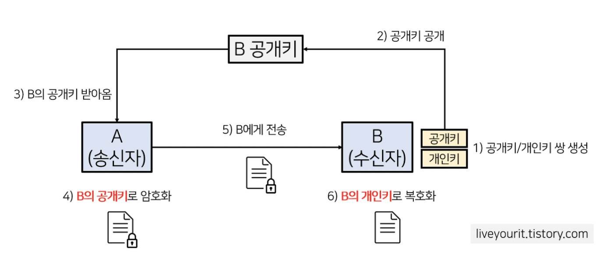

# 대칭키 & 공개키

# 한 문장 정리‼️

### 대칭키

암복호화에 사용하는 키가 동일한 암호화 방식

### 공개키

대칭키의 키교환 문제를 해결하기 위해 암복호화에 사용하는 키가 서로 다르며 비대칭키 암호화 방식.

---

# 0. 개요

큰틀에서 차이를 보면, 

- **대칭키 암호화 방식**은 암복호화에 사용하는 키가 동일한 암호화 방식.
- **공개키 암호화 방식**은 암복호화에 사용하는 키가 서로 다르며 따라서 비대칭키 암호화 방식.
    - 따라서 공개키 암호화 에서는 송수신자 모두 한쌍의 키(개인키,공개키)를 갖게 됨.

# 1. 대칭키란?

대칭키는 **암복호화키가 동일하며 해당 키를 아는 사람만이 문서를 복호화**해 볼 수 있게 됨. 대표적인 알고리즘으로 DES, 3DES, AES, SEED, ARIA 등이 있음.

### 장점

- 공개키 암호화 방식에 비해 속도가 빠름.

### 단점

- 키를 교환해야하는 문제(키 배송 문제)
    - 키를 교환하는 도중 키 탈취 문제
    - 사람이 증가할수록 전부 따로 키교환을 해야하므로 관리해야 할 키가 방대해짐.
        - 이러한 키 배송 문제를 해결하기 위한 방법으로 **키의 사전 공유에 의한 해결, 키 배포센터에 의한 해결 , Diffie-Hellman 키 교환에 의한 해결, 공개키 암호에 의한 해결**이 있음.

# 2. 공개키란?

대칭키의 키교환 문제를 해결하기 위해 등장한 것이 공개키(비대칭키) 암호화 방식.

이름 그대로 키가 공개되어있기 때문에 키를 교환할 필요가 없어지며 **공개키는 모든 사람이 접근 가능한 키이고 개인키는 각 사용자만이 가지고 있는 키**임.

예를 들어, a가 b 에게 데이터를 보낸다고 할 때, A는 B의 공개키로 암호화한 데이터를 보내고 B는 본인의 개인키로 해당 암호화된 데이터를 복호화해서 보기 때문에 암호화된 데이터는 B의 공개키에 대응되는 개인키를 갖고 있는 B만이 볼 수 있게 됨.

따라서 공개키는 키가 공개되어 있기 떄문에 따로 키교환이나 분배를 할 필요가 없음.

### 원리

1. **수신자** 공개키/개인키 쌍 생성
2. 공개키 공개(등록), 개인키는 본인이 소유
3. **송신자가** 수신자의 공개키를 받음.
4. **송신자가** **수신자의 공개키**를 사용해 데이터를 암호화
5. 암호화된 데이터를 **수신자**에게 전송
6. 수신자는 암호화된 데이터를 **수신자의 개인키**로 복호화

### 장점

- 키 분배 필요 없음
- 기밀성/ 인증 / 부인방지 기능 제공
    - 기밀성: 중간 공격자가 수신자의 공개키를 얻어도 수신자의 개인키로만 복호화가 가능
    - 인증 기능 : 개인키를 가지고 있는 수신자만이 암호화된 데이터를 복호화 할 수 있음.

### 단점

- 대칭키 암호화 방식에 비해 속도가 느림.

---

### 참고자료

[[암호학] 대칭키 vs 공개키(비대칭키) 암호화 차이](https://liveyourit.tistory.com/183)
