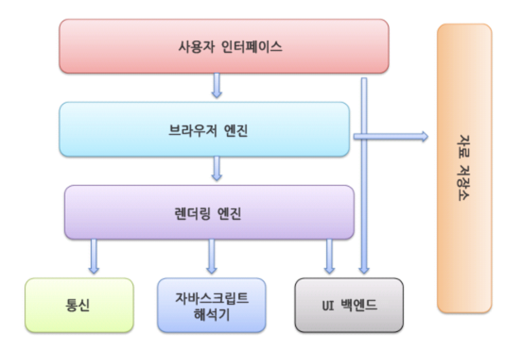

# 브라우저의 작동 원리 ( 렌더링 관점 )

# 한 문장 정리‼️

과연 이것을 한 문장으로 정리할 수 있을까...?!ㅋㅋ

---

# 0. 개요

브라우저는 사용자가 월드와이드웹(www)를 사용하는데 있어 가장 필수적인 소프트웨어임.

과거 최초의 웹 브라우저인 Erwise로부터 시작된 이 소프트웨어는 사용자들에게 인터넷의 자료를 재구성해 읽기 쉽게 제공한다는 기능을 제공하는것에서 크게 변한것 없이 지금까지도 여러 갈래로 파생되고 업데이트되며 발전

전세계에서 가장 많이 사용하는 웹 브라우저 소프트웨어인 **크롬, 파이어폭스, 사파리**에 대해 알아볼것이며 서로 어떤 점에서 차별화가 되어있는지,

브라우저 주소창에 URL을 입력하는 과정부터 웹사이트가 화면에 보이기까지의 과정에 대해 하나씩 알아보자!

# 1. 브라우저의 주요 기능

현대의 브라우저는 다양한 기능을 제공하고 있지만 중심이 되는 기능은 **사용자가 선택한 자원을 서버에 요청하고 그것을 해석하여 브라우저에 표시하는 것**

자원은 대부분 HTML 문서지만 제공하는 기능에 따라 PDF나 이미지, 또는 다른 형태의 파일일수도 있음.

- 이런 자원의 주소는 URI(Uniform Resource Identifier)에 의해 정해짐.

브라우저는 HTML, CSS에 지정된 명세에 따라 자원 파일(HTML)을 해석해서 표시하는데 이는 웹 표준화 기구인 W3C(World Wide Web Consortium)에서 정함.

- w3c에서 운영중인 사이트인 w3cSchool에서는 최신 웹 기능과 예제들을 사용해 볼 수 있다.
- 우리곁에서 쉽게 볼수있는 브라우저인 크롬, 파이어폭스등의 최신 소프트웨어들은 모두 이 표준 명세를 따름. (하지만 브라우저마다 서로 다르게 작동하는 부분도 있음)

브라우저의 UI(User Interface)는 서로 닮은 모습인것을 볼수 있는데 보통 다음과 같은 요소들이 일반적으로 포함함.

1. URL을 입력할 수 있는 **주소 표시 줄**
2. 이전 페이지, 다음 페이지 버튼
3. 북마크(즐겨찾기)
4. 새로고침 버튼과 현재 문서의 로드를 중도정지할 수 있는 버튼
5. 홈 버튼

비록 브라우저의 UI에는 표준 명세가 없음에도 불구하고 지난 수년간 서로의 기능을 모방하며 비슷한 모습을 갖추게 됨.

- 그럼에도 각자 브라우저만의 장단점과 최대의 퍼포먼스를 낼 수 있는 환경이 다르기 때문에 여러 브라우저가 현재까지도 자신들만의 팬층(점유율)을 유지한 채 이어져 오는 중임.

# 2. 브라우저의 기본 구조

브라우저의 주요 구성 요소

1. 사용자 인터페이스(UI) : 요청한 페이지를 보여주는 창을 제외한 모든 부분으로 주소 표시줄, 이전/다음 버튼, 북마크 메뉴등이 이에 해당.
2. 브라우저 엔진 : 사용자 인터페이스와 렌더링 엔진 사이의 동작을 제어.
3. 렌더링 엔진 : 요청한 컨텐츠를 표시
    - 만약 HTML을 요청하면 HTML과 CSS를 파싱(해석)하여 화면에 표시
4. 통신 : HTTP 요청과 같은 네트워크 호출에 사용됨. 
    - 이것은 플랫폼의 독립적인 기능이고 각 플랫폼의 하부에서 실행.
5. UI 백엔드 : 콤보박스나 글 입력 폼등의 기본적인 장치를 그림.
    - 플랫폼에서 명시하지 않은 인터페이스로 OS 사용자 인터페이스 체계를 사용.
6. 자바스크립트 해석기 : 자바스크립트 코드를 해석하고 실행.
7. 자료 저장소 : 자료를 저장하는 계층으로 쿠키나 로컬 스토리지등의 자료가 저장되는 저장소.
    - 이는 하드디스크에 저장되며 **HTML명세**등도 이곳에 저장됨.



### 렌더링 엔진이란?

렌더링 엔진의 역할은 **사용자로부터 요청받은 내용을 브라우저 화면에 표시**하는 일임.

- HTML, XML, 이미지등을 표시할 수 있음.


- HTML 파싱 :
    - 렌더링 엔진은 먼저 HTML 문서를 파싱하고 콘텐츠 트리 내부에서 태그를 DOM노드로 변환.
    - 그 다음 외부 CSS파일에 포함된 스타일 요소도 파싱
    - 그후 스타일 정보와 HTML 표시 규칙은 렌더 트리 라고 부르는 또다른 트리를 구축
- 렌더 트리 구축 :
    - 렌더 트리는 색상 또는 면적과 같이 시각적 속성이 있는 사각형을 포함하고 있는데 이를 정해진 순서대로 화면에 표시하는 역할을 함.
- 랜더 트리 배치 :
    - 렌더 트리 구축이 끝나면 실제 배치가 시작되는데 이것은 각 DOM노드가 정해진 위치에 표시하는것을 의미함.
- 렌더 트리 그리기 :
    - 이 과정은 UI 백엔드에서 실행되며 렌더 트리의 각 노드를 거치며 형상을 만들어내는 과정.

이런 일련의 과정이 순서대로 진행되는것이 렌더링 엔진임.

- 최신 렌더링 엔진들은 좀더 빠르고 쾌적한 사용자 경험을 위해 가능한 빨리 내용을 표시하는데 모든 HTML을 파싱할때까지 기다리는것이 아닌 배치와 그리기 과정부터 시작.
- 그런 후 네트워크로부터 나머지 내용(사용자 이름이나 글 제목, 본문 등)을 전송받는대로 화면에 표시함.
- 이런 방법을 통해 사용자는 빈 화면을 보며 기다리지 않고 화면이 그려지는것부터 볼 수 있게 되었다.

### 파싱

DOM 트리를 구축하기 위해서는 먼저 파싱 과정을 거쳐야 함.

- 이는 브라우저가 코드를 이해할 수 있는 구조로 변환하는 과정을 의미하며 파싱 결과는 보통 문서 구조를 나타내는 노드 트리인데 이를 **파싱 트리** 또는 **문법 트리**라고 부름.

파싱은 **어휘 분석**과 **구문 분석**으로 분류할 수 할 수 있음.


- 문서 : 렌더링 엔진에 전송되는 HTML 문서
- 어휘 분석 : 자료를 토큰으로 분해하는 과정.
    - 이 과정에서 공백과 줄 바꿈과 같은 의미없는 문자들을 제거(전처리)
- 구문 분석 : 언어의 구문 규칙을 적용하는 과정.

파싱의 마지막 단계에 위치한 **파서**는 구문 분석으로 얻은 정보를 토대로 문서 구조를 분석해 **파싱 트리**를 생성

- 이 과정은 반복되며 어휘 분석단계로부터 토큰을 받아 구문 분석에서 제공한 규칙 정보와 일치하는지 검사.
- 값이 참이면 해당 노드가 파싱 트리에 추가되고 파서는 또다른 토큰을 요청
- 만약 규칙에 맞지 않으면 파서는 토큰을 내부적으로 저장하고 이에 일치하는 규칙이 발견될때까지 계속해서 구문 분석을 요청.
- 맞는 규칙이 없을경우 예외처리되는데 이는 문서가 유효하지 않고 구문 오류를 포함하고 있다는 의미.

### 변환


위 과정을 통해 생성된 파싱 트리는 DOM요소로 변환 될 수 있는데 DOM이란 문서 객체 모델(Document Object Model)의 줄임말임.

- 이것은 HTML 문서의 객체 표현이며 자바스크립트와 같은 HTML요소의 연결 지점.
- 이러한 DOM은 마크업과 1대1 관계를 맺음. 예를들어 아래와 같은 마크업이 있을경우

```html
<html>
  <body>
    <p>Hello World</p>
    <div></div>
  </body>
</html>
```


HTML과 마찬가지로 DOM에도 w3c에 의해 일종의 명세가 정해져있음.

- 이는 문서에 대한 일반적인 명세인데 HTML요소를 설명하는 부분도 포함됨.
- 이와같은 과정을 거쳐 구축된 DOM트리는 렌더트리에 대응되어 우리가 흔히 아는 HTML문서로 변환됨.

### CSS 파싱

CSS는 HTML과는 다르게 문맥이 자유로운 문법이고 파서를 이용해서 파싱이 가능하고 CSS 명세(CSS 어휘와 문법을 정의)를 따름. 

아래는 정규 표현식으로 정의된 **어휘 문법**과 BNF으로 정의된 **구문 문법**.


크롬의 렌더링 엔진인 **웹킷**은 위에서 서술한 CSS 문법 파일로부터 파서를 생성하기 위해 **플렉스와 바이슨 파서 생성기**를 사용한다. 

- 바이슨은 상향식 이동 감소 파서를 생성하는데 해당 파서는 CSS 파일을 스타일 시트 객체로 파싱시키며 각 객체는 CSS 규칙을 포함.
- 해당 CSS 규칙 객체는 선택자와 선언 객체 그리고 CSS 문법과 일치하는 다른 객체를 포함


### 스크립트와 스타일 시트의 진행 순서


웹은 **파싱과 실행이 동시에 수행되는 동기화(synchronous) 모델.**

- 스크립트가 실행되는동안 문서의 파싱은 중단.
- 만약 스크립트가 서버 내부가 아닌 외부에 있는 경우, 네트워크로부터 자원을 가져오게 되는데 이또한 실시간으로 처리되며 자원을 전부 전송받을때까지 문서의 파싱은 중단.

스타일 시트의 경우 일반적으로는 DOM 트리를 변경하지 않기 때문에 문서 파싱을 기다릴필요가 없음.

- 그러나 **스크립트가 문서를 파싱하는동안 스타일 정보를 요청하는 경우**에는 문제 발생.
- 스타일이 파싱되지 않은 상태라면 스크립트는 잘못된 결과값을 내놓기 때문에 많은 문제를 유발.
- 이런 상황이 흔치 않을지도 모른다고 생각할 수 있겠지만 생각외로 많이 발생하는 이슈
- 이러한 상황이 발생했을때 렌더링 엔진들간의 차이점이 나타나는데
    - **Webkit**의 경우 로드되지 않은 스타일 시트중 문제가 될만한 속성이 있을때만 스크립트를 중단.
    - **Gecko**는 로드 대기중이거나 파싱중인 스타일 시트가 있더라도 모든 스크립트를 중지함.

### 렌더 트리 구축

렌더링 엔진이 DOM 트리를 구축되는동안 브라우저 엔진은 렌더 트리를 구축함. 

- 렌더 트리란 문서를 **시각적인 구성 요소로 변환시켜주는 역할**을 하며 이 과정에 있어서 스타일의 경우 브라우저에서 제공하는 기본 스타일 시트를 따라가게 됨.
- 이때 DOM 트리와 렌더 트리가 완전히 1대1로 대응되어 변환되지는 않으며  display: none, hidden등은 렌더 트리에 포함되지 않음.


### 웹 페이지에 배치

렌더 트리가 생성되고 나면 웹 페이지에 배치하기 시작하는데 이 과정을 **리플로(Reflow)**라고 부름.

- 브라우저의 좌표 **0, 0**부터 시작하여 각 영역에 해당되는 Viewport 만큼의 면적을 가지며 배치됨.
- 과정에서 일부 영역에 변경이 발생할 경우 **전역 배치**와 **점증 배치**가 발생.
    - **전역 배치**는 렌더링 전체에 영향을 주는 전역 스타일의 변경 사항이 있을경우 발생.
    - **점층 배치**는 **더티 렌더러**가 배치되는 경우 비동기적으로 발생함.
        - **더티 렌더러**란 변경 요소를 브라우저가 특수히 지정하여 해당 요소만 변경하는것을 의미.

브라우저에서는 렌더 트리를 활용해 실제로 화면에 우리가 보는 도형과 텍스트를 그리기 시작하는데, 이때 더티 렌더러의 Paint 메서드를 호출함과 동시에 UI Backend 요소를 이용해 그림.

각각의 요소는 **블록 렌더러**의 순서에 따라 그짐.

1. 배경
2. 배경 이미지
3. 테두리
4. 자식 엘리먼트
5. 아웃라인

해당 과정이 끝나고 모든 요소가 그려지고 난 뒤에 브라우저에서 변경이 발생할 경우 **리플로(Reflow)**와 **리페인트(Repain)**가 실행됨.

- 리페인트는 **변경된 스타일을 다시 적용하는 기능**을 하며 만약 크기와 위치도 변경되었을 경우 **리플로도 실행됨**

이 모든 과정이 끝나고 나면 우리가 평소에 사용하는 웹사이트의 모습을 볼 수 있게 됨!!!

---

### 참고자료

[웹 브라우저의 작동 구조](https://velog.io/@glm777/웹-브라우저-작동-구조-백산의-기술-블로그)
